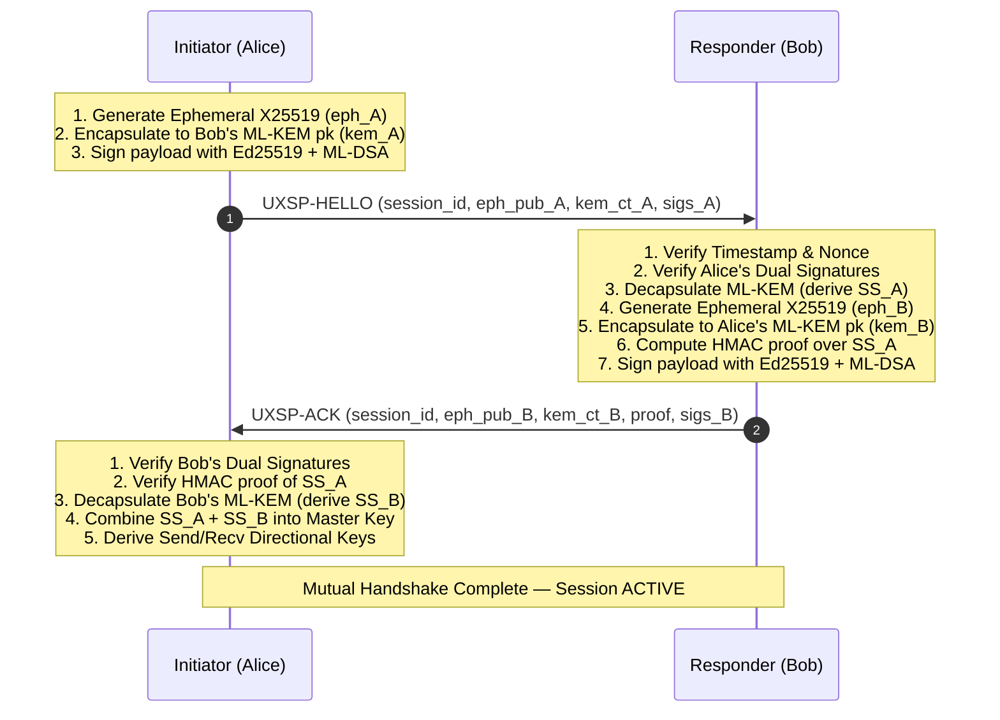

# UXSP Formal Protocol Specification

**Status**: Standard  
**Version**: 1.3.0  
**Date**: September 2026  
**Document Identifier**: UXSP-SPEC-1.3  
**Author**: Siva Raja S (<sivaraja5401@gmail.com>)

---

## Abstract

The Universal Exchange Security Protocol (UXSP) is an open, hybrid post-quantum transport-agnostic security protocol. UXSP establishes mutually authenticated, end-to-end encrypted, replay-protected, and forward-secret communication channels. It is engineered to maintain unconditional security against active classical adversaries and long-term "Harvest Now, Decrypt Later" (HNDL) attacks executed by cryptanalytically relevant quantum computers (CRQCs).

This document formally defines the protocol architecture, cryptographic primitives, threat model, security guarantees, identity framework, canonical serialization rules, nonce and freshness mechanics, sequence numbering, the three-step mutual handshake state machine, session lifecycles, version negotiation rules, and error classifications.

---

## 1. Introduction & Objectives

### 1.1 Requirements Language
The key words "**MUST**", "**MUST NOT**", "**REQUIRED**", "**SHALL**", "**SHALL NOT**", "**SHOULD**", "**SHOULD NOT**", "**RECOMMENDED**", "**NOT RECOMMENDED**", "**MAY**", and "**OPTIONAL**" in this document are to be interpreted as described in BCP 14 [RFC 2119] [RFC 8174] when, and only when, they appear in all capitals, as shown here.

### 1.2 Core Architectural Objectives
1. **Hybrid Post-Quantum Defense-in-Depth**: Every key exchange and digital signature MUST combine an audited classical algorithm with a standardized Post-Quantum Cryptography (PQC) algorithm. An adversary must compromise *both* mathematical foundations simultaneously to break confidentiality or authenticity.
2. **Transport Agnosticism**: UXSP payloads are self-contained envelopes capable of traversing HTTP/HTTPS, WebSockets, WebRTC DataChannels, raw TCP/UDP, message queues (Kafka, RabbitMQ), or offline persistent files.
3. **Cryptographic Identity & Trust Anchors**: Strong zero-trust identity verification utilizing four-key public cards (`PublicCard`), optional hierarchical Trust Anchor root signatures, and cryptographic revocation checks.
4. **Replay & Tamper Immunity**: Defense against replay, delay, truncation, and re-ordering attacks via strict time-window bounding, durable nonce storage, and monotonic AEAD sequence binding.
5. **Fail-Closed Semantics**: Any anomaly in header fields, decoding, time freshness, sequence ordering, or cryptographic verification MUST terminate processing immediately without disclosing diagnostic side-channel information to an untrusted sender.

---

## 2. Threat Model & Security Guarantees

### 2.1 Adversary Model
UXSP assumes an adversary with full control over the communication network (the Dolev-Yao model), with the following capabilities:
- **Eavesdropping**: Intercept and store all transmitted frames indefinitely.
- **Active Manipulation**: Inject, modify, duplicate, reorder, delay, or drop messages.
- **Quantum Capability**: The adversary is projected to possess a Cryptanalytically Relevant Quantum Computer (CRQC) capable of running Shor's algorithm (breaking discrete logarithms and integer factorization, including RSA, ECDH, ECDSA, and Ed25519) and Grover's algorithm (halving symmetric security levels).

### 2.2 Formal Security Guarantees

| Security Property | Mathematical Primitives | Security Level | Formal Guarantee |
| :--- | :--- | :--- | :--- |
| **Confidentiality** | X25519 + ML-KEM-768 + AES-256-GCM | 256-bit Classical / Category 3 PQC (192-bit quantum) | **IND-CCA2**: Indistinguishability under Adaptive Chosen-Ciphertext Attack. |
| **Integrity & Authenticity** | Ed25519 + ML-DSA-65 + AES-256-GCM AEAD Tag | 128-bit Classical / Category 3 PQC (192-bit quantum) | **EUF-CMA**: Existential Unforgeability under Chosen-Message Attack. |
| **Forward Secrecy (PFS)** | Ephemeral X25519 + Ephemeral ML-KEM-768 | Ephemeral key destruction | Compromise of long-term identity keys reveals no past session plaintexts. |
| **Post-Compromise Security** | Periodic session re-keying & rotation | Fresh ephemeral contributions | Session re-handshake restores secrecy after transient state compromise. |
| **Replay Immunity** | Timestamp window + NonceStore + AEAD AD | 128-bit random nonces + TTL indexing | Exact-once message acceptance. |

---

## 3. Cryptographic Algorithm Suites & Identifiers

UXSP assigns explicit 16-bit big-endian unsigned integers (`uint16`) to cryptographic algorithm suites.

### 3.1 Suite Registry

```
+---------------+-------------------------------+------------------------------------------------------+
| Identifier    | Symbolic Name                 | Composition Details                                  |
+---------------+-------------------------------+------------------------------------------------------+
| 0x0001        | UXSP_SUITE_HYBRID_DEFAULT     | Classical ECDH:     X25519 (RFC 7748)                |
| (Default)     |                               | PQC KEM:            ML-KEM-768 (FIPS 203)            |
|               |                               | Classical Sig:      Ed25519 (RFC 8032)               |
|               |                               | PQC Sig:            ML-DSA-65 (FIPS 204)             |
|               |                               | AEAD Cipher:        AES-256-GCM (NIST SP 800-38D)    |
|               |                               | KDF / PRF:          HKDF-SHA256 (RFC 5869)           |
|               |                               | Passphrase KDF:     Argon2id (RFC 9106)              |
+---------------+-------------------------------+------------------------------------------------------+
| 0x0002        | UXSP_SUITE_CLASSICAL_FALLBACK | Classical ECDH:     X25519 (RFC 7748)                |
| (Restricted)  |                               | Classical Sig:      Ed25519 (RFC 8032)               |
|               |                               | AEAD Cipher:        AES-256-GCM (NIST SP 800-38D)    |
|               |                               | KDF / PRF:          HKDF-SHA256 (RFC 5869)           |
|               |                               | Passphrase KDF:     Argon2id (RFC 9106)              |
+---------------+-------------------------------+------------------------------------------------------+
| 0x0003        | UXSP_SUITE_HYBRID_ULTRA       | Classical ECDH:     X448 (RFC 7748)                  |
| (Reserved)    |                               | PQC KEM:            ML-KEM-1024 (FIPS 203)           |
|               |                               | Classical Sig:      Ed448 (RFC 8032)                 |
|               |                               | PQC Sig:            ML-DSA-87 (FIPS 204)             |
|               |                               | AEAD Cipher:        AES-256-GCM / ChaCha20-Poly1305  |
|               |                               | KDF / PRF:          HKDF-SHA512 (RFC 5869)           |
+---------------+-------------------------------+------------------------------------------------------+
```

### 3.2 Key Sizes and Output Lengths (Suite `0x0001`)

- **X25519 Public Key**: Exactly 32 bytes (`0x20`).
- **X25519 Private Key**: Exactly 32 bytes (`0x20`).
- **ML-KEM-768 Public Key**: Exactly 1,184 bytes (`0x04A0`).
- **ML-KEM-768 Private Key**: Exactly 2,400 bytes (`0x0960`).
- **ML-KEM-768 Ciphertext**: Exactly 1,088 bytes (`0x0440`).
- **ML-KEM-768 Shared Secret**: Exactly 32 bytes (`0x20`).
- **Ed25519 Public Key**: Exactly 32 bytes (`0x20`).
- **Ed25519 Private Key**: Exactly 32 bytes (`0x20`).
- **Ed25519 Signature**: Exactly 64 bytes (`0x40`).
- **ML-DSA-65 Public Key**: Exactly 1,952 bytes (`0x07A0`).
- **ML-DSA-65 Private Key**: Exactly 4,032 bytes (`0x0FC0`).
- **ML-DSA-65 Signature**: Exactly 3,309 bytes (`0x0CED`).
- **AES-256-GCM Key**: Exactly 32 bytes (`0x20`).
- **AES-256-GCM IV (Nonce)**: Exactly 12 bytes (`0x0C`).
- **AES-256-GCM Auth Tag**: Exactly 16 bytes (`0x10`).

---

## 4. Canonical Encoding & Serialization Rules

To prevent canonicalization ambiguity, signature malleability, and length-confusion attacks, all signable and authenticatable buffers in UXSP MUST be assembled strictly according to the **Length-Prefixed Framing Rule**.

### 4.1 The `bind_fields` Construction
When constructing canonical bytes for digital signatures or authentication proofs, implementations MUST concatenate fields using big-endian 32-bit unsigned length prefixes (`uint32`, 4 bytes):

$$\text{CanonicalBuffer}(F_1, F_2, \dots, F_n) = \bigparallel_{i=1}^{n} \Big( [|F_i|]_{32\text{-bit BE}} \parallel F_i \Big)$$

Where:
- $[L]_{32\text{-bit BE}}$ is the 4-byte network-byte-order (big-endian) representation of integer $L$.
- $F_i$ is a sequence of raw bytes. String parameters (e.g., entity IDs, version identifiers, timestamps) MUST be converted to UTF-8 without null terminators or trailing whitespace before evaluation.
- Field length $|F_i|$ MUST NOT exceed $2^{32} - 1$ bytes ($4\text{ GiB}$).

```
+--------------------------+-----------------------+--------------------------+-----------------------+
| Field 1 Length (4 bytes) | Field 1 Bytes (N1 B)  | Field 2 Length (4 bytes) | Field 2 Bytes (N2 B)  |
| [uint32 Big-Endian]      | raw bytes             | [uint32 Big-Endian]      | raw bytes             |
+--------------------------+-----------------------+--------------------------+-----------------------+
```

### 4.2 Prohibited Representations
- Delimiters such as commas, colons, or line breaks MUST NOT be used without length prefixes to separate variable-length strings in signable payloads.
- Floating-point representations for timestamps are strictly prohibited; timestamps MUST be integer quantities.
- Hexadecimal strings MUST use lowercase ASCII characters (`0-9`, `a-f`).

---

## 5. Key Identifiers & Identity Management

### 5.1 Public Identity Card (`PublicCard`)
Every participant in a UXSP network is represented by a `PublicCard` containing identity metadata and public keys for all four suite algorithms:

```json
{
  "version": "UXSP-PUBCARD-1",
  "entity_id": "urn:uuid:f47ac10b-58cc-4372-a567-0e02b2c3d479",
  "name": "Alice Enterprise Gateway",
  "role": "service",
  "created_at": "2026-09-10T08:00:00Z",
  "public_keys": {
    "exchange_pub": "<64 hex chars = 32 bytes X25519>",
    "kem_pub": "<2368 hex chars = 1184 bytes ML-KEM-768>",
    "signing_pub": "<64 hex chars = 32 bytes Ed25519>",
    "pqc_sig_pub": "<3904 hex chars = 1952 bytes ML-DSA-65>"
  },
  "key_version": 1,
  "valid_until": "2027-09-10T08:00:00Z",
  "is_revoked": false,
  "revocation_reason": null,
  "revoked_at": null
}
```

### 5.2 Trust Anchors & Signed Cards
For zero-trust environments requiring Public Key Infrastructure (PKI):
1. A **Trust Anchor** (Root CA) maintains an authoritative Ed25519 + ML-DSA-65 keypair.
2. The Trust Anchor signs an entity's `PublicCard` payload across a specified validity window ($[T_{\text{not\_before}}, T_{\text{not\_after}}]$) to produce a `SignedCard`.
3. Verifying endpoints MUST reject any `SignedCard` if:
   - The Trust Anchor is not present in the local `TrustStore`.
   - The current time $T < T_{\text{not\_before}}$ (premature).
   - The current time $T > T_{\text{not\_after}}$ (expired).
   - The dual classical or post-quantum signature fails verification.
   - `is_revoked` is set to `true`.

### 5.3 Key Rotation & Revocation
- **Rotation**: Identities SHOULD rotate hybrid keypairs at scheduled intervals. When `key_version` increments, existing sessions remain valid until expiry, but new handshakes MUST require the active `key_version`.
- **Revocation**: Revocation records MUST include an ISO 8601 timestamp and reason code. Revoked cards MUST be purged from caches immediately.

---

## 6. Nonce, Timestamp & Freshness Rules

To prevent replay, delayed injection, and cross-session reflection attacks, UXSP mandates three distinct freshness mechanisms:

### 6.1 Freshness Windows & Clock Skew
Every envelope and handshake message MUST include an integer Unix timestamp in seconds ($T_{\text{msg}}$).

Upon receipt at local clock time $T_{\text{local}}$, the receiver calculates message age:
$$\text{Age} = T_{\text{local}} - T_{\text{msg}}$$

The envelope is fresh if and only if:
$$-\Delta_{\text{skew}} \le \text{Age} \le \Delta_{\text{max}}$$

Where:
- Standard Maximum Age ($\Delta_{\text{max}}$): **300 seconds (5 minutes)**.
- Standard Maximum Clock Skew ($\Delta_{\text{skew}}$): **30 seconds**.

Any message with $\text{Age} > \Delta_{\text{max}}$ MUST be rejected with error `ENVELOPE_EXPIRED`.  
Any message with $\text{Age} < -\Delta_{\text{skew}}$ MUST be rejected with error `ENVELOPE_CLOCK_SKEW_EXCEEDED`.

### 6.2 Envelope Nonce Rules
- Every sealed envelope MUST include an `envelope_nonce` consisting of at least 16 cryptographically random bytes (128 bits of entropy), hex-encoded (32 hex characters).
- Envelopes MUST NOT reuse an `envelope_nonce` under any circumstance.

### 6.3 State Persistence via NonceStore
Receivers operating in multi-request or distributed environments MUST persist seen nonces into a `NonceStore` (In-Memory, Redis, or PostgreSQL):
- Handshake messages are indexed under `hello:<session_id>` or `ack:<session_id>` with a minimum TTL of $90\text{ seconds}$.
- Standalone envelopes are indexed under `envelope:<envelope_nonce>` with a TTL matching $\Delta_{\text{max}} + \Delta_{\text{skew}} = 330\text{ seconds}$.
- If an incoming nonce already exists in the `NonceStore`, the message MUST be dropped and logged as an active replay attack.

---

## 7. Sequence Number & Message Ordering Rules

For streaming and persistent session channels (`uxsp.core.session`), sequence numbers prevent message omission, insertion, duplication, and reordering.

### 7.1 Monotonic Sequence Assignment
- The initiating party and responding party each maintain independent, zero-indexed 64-bit unsigned integers:
  - $\text{seq}_{\text{send}}$: Monotonically incremented by 1 for every encrypted frame.
  - $\text{seq}_{\text{recv}}$: Expected incoming sequence number.
- The sequence number is cryptographically bound into the AEAD Associated Data:
  $$\text{AD} = \text{session\_id} \parallel \text{":"} \parallel \text{str}(\text{seq})$$
- Modifying the sequence number in transit causes the AES-256-GCM AEAD authentication tag check to fail.

### 7.2 Ordering Modes

```
Mode 1: Strict In-Order (Default)
Incoming Seq:  0  -->  1  -->  2  -->  3  -->  4   [ACCEPTED]
Incoming Seq:  0  -->  2  (Seq 1 missing)          [REJECTED - Out-of-Order]
Incoming Seq:  2  -->  2  (Duplicate)               [REJECTED - Replay]

Mode 2: Sliding Replay Window (Window Size W = 128)
Window: [MaxSeen - 127, ..., MaxSeen]
- Messages with Seq > MaxSeen advance the window.
- Messages inside the window are checked against a bitmask of seen packets.
- Duplicate packets or packets older than (MaxSeen - 127) are rejected.
```

### 7.3 Limits & Expiration
A session MUST transition to `EXPIRED` state and refuse further encryption/decryption when:
1. **Time limit exceeded**: $T_{\text{elapsed}} > 3600\text{ seconds}$ (1 hour default).
2. **Message cap exceeded**: Total sent + received messages $\ge 10,000$ messages.

---

## 8. Handshake Protocol & State Machine

The UXSP mutual authentication handshake establishes an encrypted, authenticated, forward-secret session between Initiator ($A$) and Responder ($B$) in 3 steps without exposing long-term private keys.



### 8.1 Step 1: `UXSP-HELLO` (Initiation)
1. Alice generates an ephemeral X25519 keypair: $(sk_{\text{eph}, A}, pk_{\text{eph}, A})$.
2. Alice performs hybrid sender exchange against Bob's `PublicCard`:
   - $SS_{\text{ecdh}, A} = \text{X25519}(sk_{\text{eph}, A}, pk_{\text{exch}, B})$
   - $(SS_{\text{kem}, A}, CT_{\text{kem}, A}) = \text{ML-KEM-Encaps}(pk_{\text{kem}, B})$
   - $SS_A = \text{HKDF-Extract-and-Expand}(SS_{\text{ecdh}, A} \parallel SS_{\text{kem}, A}, \text{salt}=pk_{\text{eph}, A}, \text{info}=\text{"UXSP-hybrid-key-exchange-v1"}, L=32)$
3. Alice builds signable bytes using canonical binding:
   $$\text{Signable} = \text{bind\_fields}(\text{"UXSP-HELLO"}, \text{versions}, \text{session\_id}, A, B, pk_{\text{eph}, A}, CT_{\text{kem}, A}, \text{timestamp})$$
4. Alice signs with both Ed25519 and ML-DSA-65.
5. Alice transmits `UXSP-HELLO` to Bob.

### 8.2 Step 2: `UXSP-ACK` (Response)
1. Bob validates message timestamp and records `hello:<session_id>` in `NonceStore`.
2. Bob verifies Alice's classical and PQC signatures using Alice's `PublicCard`.
3. Bob recovers $SS_A$ via hybrid recipient exchange:
   - $SS_{\text{ecdh}, A} = \text{X25519}(sk_{\text{exch}, B}, pk_{\text{eph}, A})$
   - $SS_{\text{kem}, A} = \text{ML-KEM-Decaps}(CT_{\text{kem}, A}, sk_{\text{kem}, B})$
   - $SS_A = \text{HKDF}(SS_{\text{ecdh}, A} \parallel SS_{\text{kem}, A}, \text{salt}=pk_{\text{eph}, A}, \dots)$
4. Bob generates an ephemeral contribution directed at Alice:
   - $(sk_{\text{eph}, B}, pk_{\text{eph}, B})$, $CT_{\text{kem}, B}$, and $SS_B$.
5. Bob computes proof-of-possession HMAC over $SS_A$:
   $$\text{Proof} = \text{HMAC-SHA256}_{SS_A}(\text{session\_id} \parallel \text{":responder-proof"})$$
6. Bob builds signable bytes, signs with Ed25519 + ML-DSA-65, and transmits `UXSP-ACK`.
7. Bob derives final session master key and activates the session.

### 8.3 Step 3: `COMPLETE` (Finalization)
1. Alice verifies Bob's dual signatures on `UXSP-ACK`.
2. Alice verifies the HMAC `Proof` against her local copy of $SS_A$. If unequal, the handshake aborts immediately (MITM attack detection).
3. Alice decapsulates $CT_{\text{kem}, B}$ to recover $SS_B$.
4. Alice derives the identical final session master key.

### 8.4 Key Derivation Tree
The master key is derived by binding both halves with the session metadata:

$$K_{\text{master}} = \text{HKDF-SHA256}\big(SS_A \parallel SS_B, \text{info}=\text{"UXSP-final-session-key:"} \parallel \text{session\_id} \parallel \text{":"} \parallel A \parallel \text{":"} \parallel B, L=32\big)$$

Independent directional keys prevent cross-talk manipulation:
- **Alice Send Key (Bob Recv Key)**:
  $$K_{A \to B} = \text{HKDF-SHA256}(K_{\text{master}}, \text{info}=\text{"UXSP-session-key-v1:enc:init_to_resp"}, L=32)$$
- **Bob Send Key (Alice Recv Key)**:
  $$K_{B \to A} = \text{HKDF-SHA256}(K_{\text{master}}, \text{info}=\text{"UXSP-session-key-v1:enc:resp_to_init"}, L=32)$$

---

## 9. Session Lifecycle State Machine

A UXSP session progresses through four discrete states:

```
                  +--------------------------------------+
                  |               PENDING                |
                  +--------------------------------------+
                                     |
                         Handshake.respond() or
                         Handshake.complete()
                                     v
                  +--------------------------------------+
                  |                ACTIVE                |
                  +--------------------------------------+
                         |                      |
            Lifetime > 3600s or          session.revoke()
            Msg Count >= 10,000                 |
                         v                      v
                  +---------------+      +---------------+
                  |    EXPIRED    |      |    REVOKED    |
                  +---------------+      +---------------+
                         |                      |
                         +----------+-----------+
                                    |
                                    v
                         Keys Securely Zeroized
                         (Memory Overwritten)
```

### 9.1 State Transitions
- **`PENDING`**: Initialized; ephemeral values generated; waiting for peer handshake message. Cannot encrypt or decrypt application data.
- **`ACTIVE`**: Handshake confirmed; directional AES keys active; message encryption and decryption allowed.
- **`EXPIRED`**: Lifetime or sequence threshold exceeded. Read/write operations fail with `SESSION_EXPIRED`. New handshake required.
- **`REVOKED`**: Session explicitly destroyed via `session.revoke()`. Stored key buffers in memory are wiped using `zeroize()` (overwriting with `0x00`). Irreversible state.

---

## 10. Compatibility & Version Negotiation

### 10.1 Version Format
UXSP version identifiers use semantic wire identifiers:
- String representation: `"UXSP-1"` (Protocol Major 1)
- Numeric versioning in negotiation: `["1"]`

### 10.2 Negotiation Algorithm
1. The Initiator includes `supported_versions` list (e.g. `["1"]`) in `UXSP-HELLO`.
2. The Responder computes the intersection with its supported list:
   $$\text{Common} = \text{Supported}_{\text{local}} \cap \text{Supported}_{\text{remote}}$$
3. If $\text{Common} = \emptyset$, the handshake terminates with `NO_COMMON_VERSION`.
4. The negotiated version is selected as:
   $$V_{\text{negotiated}} = \max(\text{Common})$$
5. $V_{\text{negotiated}}$ is explicitly included in `UXSP-ACK` and cryptographically bound into both signatures. An attacker tampering with version lists in transit will trigger signature verification failure (downgrade attack immunity).

### 10.3 Classical Fallback Policy
Under strict enterprise policy, `allow_classical_only` MUST be `False`. If set to `True` (e.g. for legacy or constrained microcontrollers lacking PQC capabilities), the envelope MUST set `pqc_mode = "none"` and omit `kem_ciphertext` and `pqc_sig`. Receivers configured with `allow_classical_only=False` MUST reject classical-only messages immediately.

---

## 11. Error Codes & Failure Modes Registry

All UXSP implementations MUST map protocol failures to the following standardized registry. All verification and authentication failures MUST fail closed.

| Error Code (Hex) | Symbolic Identifier | Category | Trigger Condition & Handling |
| :--- | :--- | :--- | :--- |
| `0x0001` | `ERR_VALIDATION_MISSING_FIELD` | Validation | Required field missing in wire envelope or handshake message. Reject packet. |
| `0x0002` | `ERR_VALIDATION_INVALID_HEX` | Encoding | Field expected to be hex contains invalid characters or odd byte length. |
| `0x0003` | `ERR_VALIDATION_TOO_LARGE` | DoS Protection | Envelope serialised size exceeds configured cap (default 64 KiB). Reject before crypto. |
| `0x0004` | `ERR_TIMESTAMP_EXPIRED` | Freshness | Envelope age exceeds maximum freshness window ($\Delta t > 300\text{s}$). Reject. |
| `0x0005` | `ERR_TIMESTAMP_FUTURE_SKEW` | Freshness | Message timestamp is in the future beyond acceptable skew ($\Delta t < -30\text{s}$). |
| `0x0006` | `ERR_REPLAY_NONCE_DUPLICATE` | Replay Guard | `envelope_nonce` or handshake `session_id` already exists in `NonceStore`. |
| `0x0007` | `ERR_IDENTITY_RECIPIENT_MISMATCH`| Routing | `recipient_id` does not match the local entity identity. Reject. |
| `0x0008` | `ERR_IDENTITY_SENDER_MISMATCH` | Identity | `sender_id` does not match the provided public key certificate. |
| `0x0009` | `ERR_SIG_CLASSICAL_VERIFY_FAIL` | Cryptography | Ed25519 signature verification failed. Possible payload tampering. |
| `0x000A` | `ERR_SIG_PQC_VERIFY_FAIL` | Cryptography | ML-DSA-65 signature verification failed. Possible quantum or classical forgery. |
| `0x000B` | `ERR_AEAD_DECRYPT_FAIL` | Cryptography | AES-256-GCM tag mismatch. Tampered ciphertext or wrong symmetric key. |
| `0x000C` | `ERR_KEM_DECAPSULATE_FAIL` | Cryptography | ML-KEM-768 decapsulation failed. Corrupted ciphertext. |
| `0x000D` | `ERR_HANDSHAKE_PROOF_MISMATCH` | Handshake | Responder HMAC proof over $SS_A$ failed. Active MITM detected. |
| `0x000E` | `ERR_HANDSHAKE_NO_COMMON_VER` | Negotiation | No shared protocol version found between peers. |
| `0x000F` | `ERR_SESSION_NOT_ACTIVE` | Session State | Encrypt/decrypt called on session that is PENDING, EXPIRED, or REVOKED. |
| `0x0010` | `ERR_SESSION_REORDER_SEQ` | Ordering | Monotonic sequence gap or within-session replayed sequence number. |
| `0x0011` | `ERR_SESSION_EXPIRED_LIMIT` | Session State | Maximum session lifetime (1h) or message count (10,000) reached. |
| `0x0012` | `ERR_TRUST_ANCHOR_UNTRUSTED` | PKI | SignedCard issuer not found in local `TrustStore`. |
| `0x0013` | `ERR_CARD_REVOKED` | PKI | PublicCard or SignedCard has `is_revoked=true`. |
| `0x0014` | `ERR_PAYLOAD_MAGIC_MISMATCH` | Payload | Internal payload missing `UXSP-PAYLOAD-1` or chunk missing `UXSP-CHUNK-1`. |
| `0x0015` | `ERR_CHUNK_HASH_MISMATCH` | Chunking | Per-chunk SHA-256 hash or whole-file SHA-256 hash does not match payload. |
