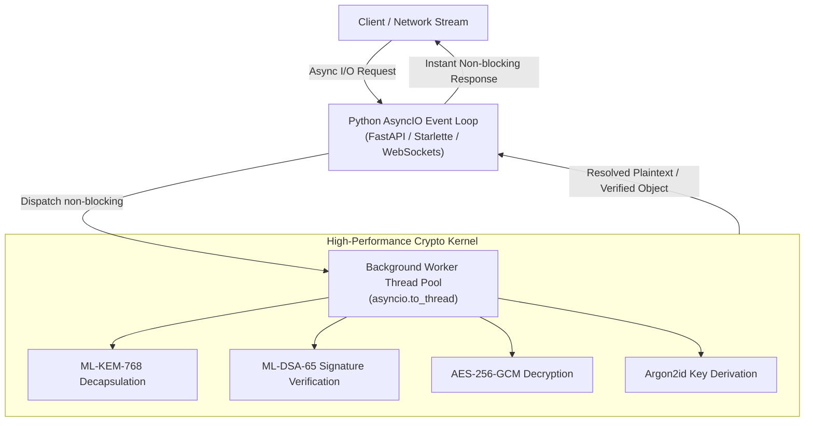

# Comprehensive Guide to Native Async Engine (`uxsp.aio`)

When building high-throughput asynchronous Python applications (such as FastAPI services, Quart servers, Discord bots, or WebSockets), blocking the main event loop with CPU-intensive cryptographic processing freezes the entire process, delaying all other concurrent tasks.

The `uxsp.aio` module solves this by executing CPU-heavy Post-Quantum and symmetric cryptographic routines inside a dedicated worker thread pool (`asyncio.to_thread`). This ensures your asynchronous event loop handles tens of thousands of concurrent connections smoothly.

---

## 🏛️ Mental Model: The Async Cryptographic Pipeline



---

## 1. Asynchronous Context & Identity Management

In asynchronous environments, identity lifecycle operations (generating keys, Argon2id hashing, peer key validation) must not block the loop.

### 1.1 Asynchronously Creating an Identity (`uxsp.aio.create_identity`)
- **What is it?** Generates a brand-new Post-Quantum Identity containing ML-KEM-768, ML-DSA-65, X25519, and Ed25519 keypairs off the main thread.
- **When to use?** When creating new client or server identities dynamically inside async request handlers or background startup tasks.
- **How to use:**
```python
import asyncio
import uxsp.aio as aio

async def setup_agent():
    # Generate identity without blocking the event loop
    agent = await aio.create_identity(name="AsyncWorker-01", role="worker")
    print("Created Agent Entity ID:", agent.entity_id)
    return agent

asyncio.run(setup_agent())
```
- **Line-by-Line Explanation:**
  - `import uxsp.aio as aio`: Imports the non-blocking asynchronous module of UXSP.
  - `agent = await aio.create_identity(...)`: Calls `Identity.create` inside a worker thread, returning a fully populated `Identity` object.
  - `print(...)`: Accesses the unique public entity ID of the newly generated identity.

---

### 1.2 Encrypted Identity Import & Export (`export_identity_encrypted` & `import_identity_encrypted`)
- **What is it?** Exports an `Identity` to an Argon2id-encrypted JSON string, or imports it back.
- **When to use?** When storing identities in an async database (PostgreSQL, MongoDB) or restoring them on startup without causing latency spikes.
- **How to use:**
```python
import asyncio
import uxsp.aio as aio

async def backup_and_restore(agent, secret_passphrase: str):
    # Export encrypted JSON string
    encrypted_blob = await aio.export_identity_encrypted(agent, password=secret_passphrase)
    
    # Restore identity from encrypted JSON string
    restored_agent = await aio.import_identity_encrypted(encrypted_blob, password=secret_passphrase)
    assert restored_agent.entity_id == agent.entity_id
    print("Identity successfully exported and restored.")
```
- **Line-by-Line Explanation:**
  - `await aio.export_identity_encrypted(...)`: Runs Argon2id key derivation and AES-256-GCM encryption in the thread pool, producing a secure JSON string.
  - `await aio.import_identity_encrypted(...)`: Runs Argon2id decryption in the thread pool to reconstitute the original `Identity` object.
  - `assert restored_agent.entity_id == agent.entity_id`: Confirms the cryptographic keys match the original.

---

### 1.3 Asynchronous Password Hashing & Verification (`hash_password` & `verify_password`)
- **What is it?** Native non-blocking wrappers around Argon2id password hashing and verification.
- **When to use?** When authenticating users in async web apps without blocking other HTTP requests.
- **How to use:**
```python
import asyncio
import uxsp.aio as aio

async def user_auth_demo():
    password = "SuperSecretDeveloperPassword!456"
    
    # Hash password with Argon2id in background thread
    phc_hash = await aio.hash_password(password)
    
    # Verify candidate password against hash
    is_valid = await aio.verify_password(phc_hash, password)
    print("Password valid:", is_valid)  # True
```
- **Line-by-Line Explanation:**
  - `await aio.hash_password(password)`: Hashes the password with Argon2id using salt and memory parameters off the main thread.
  - `await aio.verify_password(phc_hash, password)`: Computes the hash and validates with constant-time equality check.

---

### 1.4 Global Context & Peer Registration (`configure`, `set_identity`, `register_peer`, `rotate_keys`, `revoke_peer`, `verify_peer_validity`)
- **What is it?** Asynchronous methods to manage default runtime identities, keystores, and peer validation.
- **When to use?** At application startup or during key rotation/revocation events.
- **How to use:**
```python
import asyncio
import uxsp.aio as aio

async def initialize_cluster_security(server_identity, peer_card):
    # 1. Configure active default identity
    await aio.configure(identity=server_identity)
    
    # 2. Register trusted peer's PublicCard
    await aio.register_peer(peer_card)
    
    # 3. Verify peer card has not expired or been revoked
    await aio.verify_peer_validity(peer_card)
    
    # 4. Rotate keys if needed (derives new keypairs while maintaining identity)
    rotated_identity = await aio.rotate_keys()
    
    # 5. Revoke a compromised peer
    await aio.revoke_peer(peer_card.entity_id, reason="Suspected credential leak")
```
- **Line-by-Line Explanation:**
  - `await aio.configure(identity=server_identity)`: Sets the default global identity for all subsequent async send/receive calls.
  - `await aio.register_peer(peer_card)`: Saves the peer's public keys into the active keystore.
  - `await aio.verify_peer_validity(peer_card)`: Checks timestamps and revocation status without raising silent errors.
  - `await aio.rotate_keys()`: Generates new post-quantum and classical keypairs for the active identity.
  - `await aio.revoke_peer(...)`: Marks the peer card as revoked so future incoming messages from them will fail.

---

## 2. Polymorphic Async Dispatchers (`aio.Send` and `aio.Receive`)

- **What is it?** Unified functions that automatically inspect the incoming object type (or package data type) and dispatch to the correct specialized async handler.
- **When to use?** When building generic routers, message queues, or event busses where payloads can be text, dictionaries, binary files, or media.
- **How to use:**
```python
import asyncio
import uxsp.aio as aio

async def polymorphic_pipeline(sender, receiver_card):
    # Automatically detects dict -> SendJSON
    pkg_json = await aio.Send(receiver=receiver_card, item={"status": "online"}, sender=sender)
    
    # Automatically detects str -> SendText
    pkg_text = await aio.Send(receiver=receiver_card, item="Hello Cluster", sender=sender)
    
    # Polymorphic Receive automatically unwraps both
    unwrapped_json = await aio.Receive(package=pkg_json, sender=sender.public_card(), receiver=sender)
    unwrapped_text = await aio.Receive(package=pkg_text, sender=sender.public_card(), receiver=sender)
    
    print("Unwrapped:", unwrapped_json, unwrapped_text)
```
- **Line-by-Line Explanation:**
  - `await aio.Send(receiver=..., item={...})`: Inspects `item`, determines it is a dictionary, and delegates to `SendJSON`.
  - `await aio.Send(receiver=..., item="...")`: Inspects `item`, determines it is a string, and delegates to `SendText`.
  - `await aio.Receive(...)`: Inspects `pkg.data_type` in the envelope and executes the corresponding deserializer.

---

## 3. Specialized Async Data Type Dispatchers

UXSP provides dedicated non-blocking dispatchers for all 14 data types. Each API is showcased here once with realistic code and full explanations.

### 3.1 Asynchronous Text (`SendText` / `ReceiveText`)
- **What is it?** Asynchronously encrypts and authenticates UTF-8 strings.
- **When to use?** Chat messages, notifications, log lines, or system command strings.
- **How to use:**
```python
import asyncio
from uxsp.aio import SendText, ReceiveText

async def text_example(alice, bob_card):
    pkg = await SendText(receiver=bob_card, text="Secret command", sender=alice)
    text = await ReceiveText(package=pkg, sender=alice.public_card(), receiver=alice)
    print("Decrypted text:", text)
```
- **Line-by-Line Explanation:**
  - `await SendText(...)`: Formats text into bytes, seals inside a Post-Quantum envelope, and returns a `SecurePackage`.
  - `await ReceiveText(...)`: Unseals ciphertext and decodes bytes back to a UTF-8 Python string.

---

### 3.2 Asynchronous JSON (`SendJSON` / `ReceiveJSON`)
- **What is it?** Asynchronously serializes, encrypts, and parses arbitrary Python dictionaries and lists.
- **When to use?** REST/WebSocket payloads, database records, and microservice state synchronization.
- **How to use:**
```python
import asyncio
from uxsp.aio import SendJSON, ReceiveJSON

async def json_example(alice, bob_card):
    payload = {"account": 12345, "action": "TRANSFER", "amount": 950.50}
    pkg = await SendJSON(receiver=bob_card, data=payload, sender=alice)
    data = await ReceiveJSON(package=pkg, sender=alice.public_card(), receiver=alice)
    print("Account balance:", data["amount"])
```
- **Line-by-Line Explanation:**
  - `await SendJSON(...)`: Converts dictionary to compact JSON bytes, encrypts and signs off-thread.
  - `await ReceiveJSON(...)`: Decrypts and parses the raw JSON bytes back into a native Python dictionary.

---

### 3.3 Asynchronous Raw Binary (`SendBinary` / `ReceiveBinary`)
- **What is it?** Asynchronously encrypts raw byte arrays without string encoding overhead.
- **When to use?** Protobuf messages, encrypted state serialization, custom binary formats, or sensor data.
- **How to use:**
```python
import asyncio
from uxsp.aio import SendBinary, ReceiveBinary

async def binary_example(alice, bob_card):
    raw_payload = b"\x00\xff\xfe\x01\x10UXSP_RAW_TELEMETRY"
    pkg = await SendBinary(receiver=bob_card, data=raw_payload, sender=alice)
    output_bytes = await ReceiveBinary(package=pkg, sender=alice.public_card(), receiver=alice)
    assert output_bytes == raw_payload
```
- **Line-by-Line Explanation:**
  - `await SendBinary(...)`: Packages byte buffer directly into the cryptographic envelope.
  - `await ReceiveBinary(...)`: Verifies signatures and returns raw uncompressed decrypted bytes.

---

### 3.4 Asynchronous Generic File (`SendFile` / `ReceiveFile`)
- **What is it?** Asynchronously reads a file from disk, encrypts it, and writes the decrypted payload to a target path without blocking I/O.
- **When to use?** Handling user uploads or saving encrypted downloads on disk.
- **How to use:**
```python
import asyncio
from pathlib import Path
from uxsp.aio import SendFile, ReceiveFile

async def file_example(alice, bob_card, tmp_path: Path):
    src = tmp_path / "sample.bin"
    src.write_bytes(b"Binary file content")
    
    pkg = await SendFile(receiver=bob_card, file_path_or_bytes=src, sender=alice)
    
    dest = tmp_path / "restored.bin"
    out = await ReceiveFile(package=pkg, download_path=dest, sender=alice.public_card(), receiver=alice)
    print("Saved file to:", out)
```
- **Line-by-Line Explanation:**
  - `await SendFile(...)`: Asynchronously reads `src`, captures the original filename, and seals the contents.
  - `await ReceiveFile(...)`: Decrypts and writes bytes directly to `download_path`, returning the destination path.

---

### 3.5 Asynchronous Office Documents (`SendDocument` / `ReceiveDocument` / `SendDoc` / `ReceiveDoc`)
- **What is it?** Dispatches Word documents, spreadsheets, presentations (`.docx`, `.xlsx`, `.pptx`) with authenticated MIME types.
- **When to use?** Legal document exchange, invoice transfer, contract pipelines.
- **How to use:**
```python
import asyncio
from uxsp.aio import SendDocument, ReceiveDocument

async def doc_example(alice, bob_card, doc_bytes: bytes):
    pkg = await SendDocument(receiver=bob_card, doc_path_or_bytes=doc_bytes, filename="Contract.docx", sender=alice)
    saved_path = await ReceiveDocument(package=pkg, download_path="downloads/Contract.docx", sender=alice.public_card(), receiver=alice)
    print("Saved document to:", saved_path)
```
- **Line-by-Line Explanation:**
  - `await SendDocument(...)`: Attaches document MIME metadata and seals the payload.
  - `await ReceiveDocument(...)`: Validates that the payload contains a document before writing to disk.

---

### 3.6 Asynchronous PDF Documents (`SendPDF` / `ReceivePDF`)
- **What is it?** Dedicated dispatcher for PDF files (`application/pdf`) with strict type validation.
- **When to use?** Medical records, banking statements, verified certificates.
- **How to use:**
```python
import asyncio
from uxsp.aio import SendPDF, ReceivePDF

async def pdf_example(alice, bob_card, pdf_bytes: bytes):
    pkg = await SendPDF(receiver=bob_card, pdf_path_or_bytes=pdf_bytes, filename="Invoice_101.pdf", sender=alice)
    out = await ReceivePDF(package=pkg, download_path="downloads/Invoice_101.pdf", sender=alice.public_card(), receiver=alice)
    print("Saved PDF to:", out)
```
- **Line-by-Line Explanation:**
  - `await SendPDF(...)`: Verifies file format and seals the PDF payload.
  - `await ReceivePDF(...)`: Decrypts and saves the PDF, rejecting non-PDF type mismatches.

---

### 3.7 Asynchronous Photos & Images (`SendPhoto` / `ReceivePhoto` / `SendImage` / `ReceiveImage`)
- **What is it?** Handles image transfers (`.jpg`, `.png`, `.webp`, `.svg`) with authenticated image metadata.
- **When to use?** Secure image galleries, ID card scanning, avatar uploads.
- **How to use:**
```python
import asyncio
from uxsp.aio import SendPhoto, ReceivePhoto

async def photo_example(alice, bob_card, photo_bytes: bytes):
    pkg = await SendPhoto(receiver=bob_card, photo_path_or_bytes=photo_bytes, filename="id_card.png", sender=alice)
    out = await ReceivePhoto(package=pkg, download_path="downloads/id_card.png", sender=alice.public_card(), receiver=alice)
    print("Saved photo to:", out)
```
- **Line-by-Line Explanation:**
  - `await SendPhoto(...)`: Seals image bytes with `image/jpeg` or `image/png` metadata.
  - `await ReceivePhoto(...)`: Authenticates sender and writes verified image to disk.

---

### 3.8 Asynchronous Video (`SendVideo` / `ReceiveVideo`)
- **What is it?** Encrypts and transmits video files (`.mp4`, `.mkv`, `.mov`) asynchronously.
- **When to use?** Video messaging, CCTV recorded clips, media archiving.
- **How to use:**
```python
import asyncio
from uxsp.aio import SendVideo, ReceiveVideo

async def video_example(alice, bob_card, video_bytes: bytes):
    pkg = await SendVideo(receiver=bob_card, video_path_or_bytes=video_bytes, filename="clip.mp4", sender=alice)
    out = await ReceiveVideo(package=pkg, download_path="downloads/clip.mp4", sender=alice.public_card(), receiver=alice)
    print("Saved video to:", out)
```
- **Line-by-Line Explanation:**
  - `await SendVideo(...)`: Wraps video media bytes in Post-Quantum envelope.
  - `await ReceiveVideo(...)`: Validates video format and streams decrypted data to destination.

---

### 3.9 Asynchronous Audio & Voice Notes (`SendAudio` / `ReceiveAudio` / `SendVoice` / `ReceiveVoice`)
- **What is it?** Dispatches recorded audio files (`.mp3`, `.wav`) and voice memos (`.m4a`).
- **When to use?** Voice messaging, podcast distribution, audio transcripts.
- **How to use:**
```python
import asyncio
from uxsp.aio import SendAudio, ReceiveAudio, SendVoice, ReceiveVoice

async def audio_example(alice, bob_card, audio_bytes: bytes):
    # Send recorded audio file
    pkg_audio = await SendAudio(receiver=bob_card, audio_path_or_bytes=audio_bytes, filename="audio.mp3", sender=alice)
    out_audio = await ReceiveAudio(package=pkg_audio, download_path="downloads/audio.mp3", sender=alice.public_card(), receiver=alice)
    
    # Send short voice memo
    pkg_voice = await SendVoice(receiver=bob_card, voice_path_or_bytes=audio_bytes, filename="memo.m4a", sender=alice)
    out_voice = await ReceiveVoice(package=pkg_voice, download_path="downloads/memo.m4a", sender=alice.public_card(), receiver=alice)
```
- **Line-by-Line Explanation:**
  - `await SendAudio(...)`: Sets `audio/mpeg` content headers and encrypts audio payload.
  - `await SendVoice(...)`: Sets `voice` data type for mobile voice messaging applications.

---

### 3.10 Asynchronous HTML Content (`SendHTML` / `ReceiveHTML`)
- **What is it?** Encrypts HTML markup strings directly with UTF-8 preservation.
- **When to use?** Encrypted email bodies, web snippets, rich reporting summaries.
- **How to use:**
```python
import asyncio
from uxsp.aio import SendHTML, ReceiveHTML

async def html_example(alice, bob_card):
    html_markup = "<article><h1>Quantum Security Report</h1><p>Status: All systems operational.</p></article>"
    pkg = await SendHTML(receiver=bob_card, html_content=html_markup, sender=alice)
    markup = await ReceiveHTML(package=pkg, sender=alice.public_card(), receiver=alice)
    print("Received markup length:", len(markup))
```
- **Line-by-Line Explanation:**
  - `await SendHTML(...)`: Serializes HTML string, tags with `data_type='html'`, and seals envelope.
  - `await ReceiveHTML(...)`: Validates and decodes HTML string safely.

---

### 3.11 Asynchronous Compressed Archives (`SendArchive` / `ReceiveArchive` / `SendZip` / `ReceiveZip`)
- **What is it?** Encrypts zip/tar/gzip bundles on disk or in-memory.
- **When to use?** Database backups, code repositories, batch file distributions.
- **How to use:**
```python
import asyncio
from uxsp.aio import SendArchive, ReceiveArchive

async def archive_example(alice, bob_card, zip_bytes: bytes):
    pkg = await SendArchive(receiver=bob_card, archive_path_or_bytes=zip_bytes, filename="backup.zip", sender=alice)
    out = await ReceiveArchive(package=pkg, download_path="downloads/backup.zip", sender=alice.public_card(), receiver=alice)
    print("Saved archive to:", out)
```
- **Line-by-Line Explanation:**
  - `await SendArchive(...)`: Seals binary archive bundle with `application/zip` MIME type.
  - `await ReceiveArchive(...)`: Writes decrypted archive to disk without memory bloat.

---

### 3.12 Asynchronous Geolocation (`SendLocation` / `ReceiveLocation`)
- **What is it?** Encrypts GPS coordinates (latitude, longitude) and optional location description.
- **When to use?** Emergency responder dispatch, delivery tracking, encrypted location sharing.
- **How to use:**
```python
import asyncio
from uxsp.aio import SendLocation, ReceiveLocation

async def location_example(alice, bob_card):
    pkg = await SendLocation(receiver=bob_card, latitude=37.7749, longitude=-122.4194, description="San Francisco Headquarters", sender=alice)
    loc = await ReceiveLocation(package=pkg, sender=alice.public_card(), receiver=alice)
    print("Decrypted coordinates:", loc["latitude"], loc["longitude"], loc["description"])
```
- **Line-by-Line Explanation:**
  - `await SendLocation(...)`: Encapsulates latitude, longitude, and description into structured JSON format.
  - `await ReceiveLocation(...)`: Decrypts and returns a clean dictionary `{"latitude": float, "longitude": float, "description": str}`.

---

### 3.13 Asynchronous Contact Cards (`SendContact` / `ReceiveContact`)
- **What is it?** Encrypts structured vCard or personal contact info.
- **When to use?** Address book syncing, contact sharing in secure messaging applications.
- **How to use:**
```python
import asyncio
from uxsp.aio import SendContact, ReceiveContact

async def contact_example(alice, bob_card):
    contact = {"name": "Alice Developer", "phone": "+1-555-0199", "email": "alice@secure.example"}
    pkg = await SendContact(receiver=bob_card, contact_data=contact, sender=alice)
    card = await ReceiveContact(package=pkg, sender=alice.public_card(), receiver=alice)
    print("Decrypted contact:", card["name"], card["phone"])
```
- **Line-by-Line Explanation:**
  - `await SendContact(...)`: Validates contact data structure and seals payload.
  - `await ReceiveContact(...)`: Returns parsed contact dictionary after signature verification.

---

## 4. Asynchronous Streaming (`SendStream` & `ReceiveStream`)

When transferring multi-gigabyte files (e.g. 50GB disk images or 4K videos) across async network transports, loading the entire file into memory causes out-of-memory (OOM) crashes.

`SendStream` and `ReceiveStream` operate in constant memory: `O(chunk_size)`.


### 4.1 Asynchronous File Streaming Over WebSockets
```python
import asyncio
from uxsp.aio import SendStream, ReceiveStream

async def websocket_stream_handler(websocket, alice, bob_card, file_path):
    # Generates SecurePackage objects asynchronously one chunk at a time
    async for chunk_pkg in await SendStream(
        stream_or_path=file_path,
        chunk_size=64 * 1024,  # 64 KB per chunk
        receiver=bob_card,
        sender=alice
    ):
        # Transmit line-delimited JSON or binary over WebSocket
        await websocket.send_text(chunk_pkg.to_json())

async def receive_stream_handler(websocket, alice_card, bob, output_dest):
    async def package_generator():
        while True:
            msg = await websocket.receive_text()
            if msg == "EOF":
                break
            from uxsp import SecurePackage
            yield SecurePackage.from_json(msg)
            
    # Directly streams decrypted bytes to disk with O(chunk_size) memory
    await ReceiveStream(
        packages_or_stream=package_generator(),
        output_file=output_dest,
        sender=alice_card,
        receiver=bob
    )
```
- **Line-by-Line Explanation:**
  - `async for chunk_pkg in await SendStream(...)`: Reads 64KB slices from disk, seals each with individual authentication nonces, and yields `SecurePackage` instances.
  - `await websocket.send_text(...)`: Transmits chunk immediately without waiting for entire file to finish encrypting.
  - `await ReceiveStream(...)`: Consumes async stream, decrypts chunk in thread pool, and writes to `output_dest`.

---

### 4.2 Raw Chunk Generators (`stream_send_chunks` & `stream_receive_chunks`)
- **What is it?** Lower-level generator functions that divide raw binary buffers into signed chunk lists.
- **When to use?** When streaming binary payloads into custom protocols (gRPC, TCP sockets, IPC pipes).
- **How to use:**
```python
import asyncio
from uxsp.aio import stream_send_chunks, stream_receive_chunks

async def raw_chunk_pipeline(alice, bob_card, binary_data: bytes):
    chunk_list = []
    
    # Asynchronously split and encrypt
    async for pkg in stream_send_chunks(binary_data, chunk_size=16384, receiver=bob_card, sender=alice):
        chunk_list.append(pkg)
        
    # Asynchronously reassemble and verify
    reassembled = await stream_receive_chunks(chunk_list, sender=alice.public_card(), receiver=alice)
    assert reassembled == binary_data
```
- **Line-by-Line Explanation:**
  - `stream_send_chunks(...)`: Yields chunks with attached metadata (`stream_chunk_index`, `stream_total_chunks`).
  - `stream_receive_chunks(...)`: Reassembles and verifies integrity across all received chunks.

---

## 5. Asynchronous Real-Time Sessions (`SendLiveSession` & `SendLiveVoiceCall`)

For low-latency WebRTC streams, video calling, or live VoIP, standard JSON envelope serialization is bypassed in favor of millisecond-speed symmetric frame encryption.

```python
import asyncio
from uxsp.aio import SendLiveSession, ReceiveLiveSession, SendLiveVoiceCall, ReceiveLiveVoiceCall

async def live_session_exchange(alice, bob_card):
    # 1. Establish Video/CCTV LiveSession
    video_pkg, alice_live = await SendLiveSession(receiver=bob_card, sender=alice)
    bob_live = await ReceiveLiveSession(package=video_pkg, sender=alice.public_card(), receiver=alice)
    
    # Both sides now hold matching LiveSession keys!
    frame = b"\x00\x00\x01\xb6\x10VIDEO_FRAME_DATA"
    encrypted_frame = alice_live.encrypt_frame(frame)
    decrypted_frame, _ = bob_live.decrypt_frame(encrypted_frame)
    assert decrypted_frame == frame

async def live_voice_exchange(alice, bob_card):
    # 2. Establish Voice Call with Opus codec settings
    voice_pkg, alice_voice = await SendLiveVoiceCall(
        receiver=bob_card,
        sender=alice,
        codec="opus",
        sample_rate=48000,
        channels=2
    )
    bob_voice = await ReceiveLiveVoiceCall(package=voice_pkg, sender=alice.public_card(), receiver=alice)
    
    # Voice frames include authenticated audio parameters (sequence, mute state)
    audio_frame = b"OPUS_RAW_AUDIO_PACKET"
    enc_audio = alice_voice.encrypt_voice_frame(audio_frame)
    dec_audio, meta = bob_voice.decrypt_voice_frame(enc_audio)
    print("Voice Codec:", meta["codec"], "Sample Rate:", meta["sample_rate"])
```
- **Line-by-Line Explanation:**
  - `await SendLiveSession(...)`: Generates a high-entropy 256-bit symmetric session key, seals it inside a Post-Quantum envelope, and returns the session object.
  - `await ReceiveLiveSession(...)`: Decrypts the session key and instantiates a `LiveSession` on the receiving peer.
  - `encrypt_frame` / `decrypt_frame`: Bypasses JSON parsing for microsecond frame encryption.
  - `await SendLiveVoiceCall(...)`: Negotiates audio codec (`opus`), sample rate (`48000`), and channel count alongside the session key.

---

## 6. High-Throughput Async HTTP Client (`AsyncUXSPClient` & HTTP Dispatchers)

The `uxsp.aio` module includes autonomous asynchronous HTTP dispatchers that automatically negotiate post-quantum encryption with UXSP-enabled backends and fall back to standard HTTP for legacy endpoints.

### 6.1 Direct Dispatchers (`aio.get`, `aio.post`, `aio.put`, `aio.delete`, `aio.patch`, `aio.fetch`)
```python
import asyncio
import uxsp.aio as aio

async def client_dispatchers(client_identity):
    # Single-line async GET
    resp = await aio.get("https://api.secure.corp/v1/status", identity=client_identity)
    print("Status:", resp.status_code, "Encrypted:", resp.is_uxsp)
    
    # Single-line async POST with JSON encryption
    resp = await aio.post(
        "https://api.secure.corp/v1/orders",
        json={"item_id": 42, "qty": 1},
        identity=client_identity
    )
    if resp.is_uxsp:
        print("Decrypted server response:", resp.data)
```

### 6.2 Using `AsyncUXSPClient` Session
```python
import asyncio
from uxsp.aio import AsyncUXSPClient

async def async_client_session(client_identity):
    async with AsyncUXSPClient(identity=client_identity, allow_fallback=True) as client:
        # Talks to secure UXSP server: encrypts payload automatically
        secure_resp = await client.post("https://api.internal/transfer", json={"amount": 100})
        print("Secure Data:", secure_resp.data)
        
        # Talks to standard public server: seamlessly falls back to regular HTTP
        public_resp = await client.get("https://httpbin.org/get")
        print("Plaintext JSON:", public_resp.json())
```
- **Line-by-Line Explanation:**
  - `async with AsyncUXSPClient(...) as client`: Creates an async connection pool reusing TCP connections and capability caches.
  - `await client.post(...)`: Checks host capabilities, automatically seals payload if the server supports UXSP, and decrypts the response.

---

## 7. Cryptographic Error Handling in Async Applications

All cryptographic exceptions inherit from `SecureError`, allowing precise error handling in async web frameworks:

| Exception Class | Trigger Condition | Recommended Handling |
| :--- | :--- | :--- |
| `DuplicateMessageError` | Nonce already seen (replay attack detected). | Drop request immediately; return HTTP 409 Conflict. |
| `MessageExpiredError` | Timestamp falls outside freshness window (`[-30s, +300s]`). | Reject request; return HTTP 400 Bad Request (check system clock). |
| `InvalidSenderError` | Signature does not match sender's public keys. | Abort connection; raise HTTP 401 Unauthorized. |
| `PeerNotFoundError` | No public card registered for recipient entity ID. | Fetch public card from directory or return HTTP 404. |
| `TypeMismatchError` | Sender sent `image`, but receiver expected `document`. | Reject payload; return HTTP 422 Unprocessable Entity. |
| `CardExpiredError` | Peer's public card has passed its expiration date. | Request new card from peer or reject with HTTP 403 Forbidden. |
| `CardRevokedError` | Peer's public card was revoked. | Abort immediately; return HTTP 403 Forbidden. |

```python
import asyncio
from uxsp.aio import ReceiveJSON, SecureError, DuplicateMessageError, InvalidSenderError

async def safe_receive_pipeline(package, sender_card, receiver_identity):
    try:
        data = await ReceiveJSON(package=package, sender=sender_card, receiver=receiver_identity)
        return data
    except DuplicateMessageError:
        print("Security Alert: Replay attack intercepted and dropped!")
    except InvalidSenderError:
        print("Security Alert: Digital signature verification failed!")
    except SecureError as e:
        print("Cryptographic error occurred:", str(e))
    return None
```

---

## 8. Summary & Best Practices

1. **Always use `uxsp.aio` in ASGI frameworks**: Never call `uxsp.secure.Send` or `Receive` inside async route handlers; doing so blocks the event loop during Post-Quantum key decapsulation.
2. **Use `SendStream` / `ReceiveStream` for large media**: Keeps memory usage strictly bounded to `O(chunk_size)`.
3. **Use `LiveSession` for real-time WebRTC/audio**: Provides zero-parsing microsecond frame encryption for high-frequency packets.

