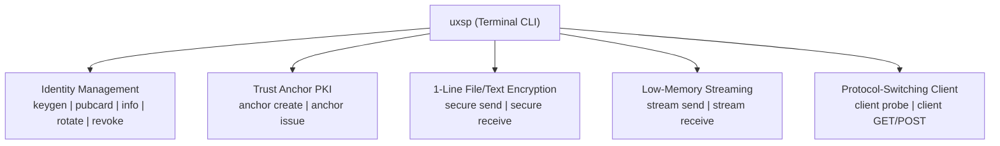

# The UXSP Command-Line Interface (CLI)

The UXSP package includes a built-in terminal CLI (`uxsp`). You can run it directly from your command line to manage cryptographic identities, issue Trust Anchor certificates, send/receive encrypted files, stream multi-gigabyte media, and test API endpoints with autonomous protocol switching.



---

## 1. Installation & Verifying the CLI

When you install `uxsp` via pip, the `uxsp` executable is registered automatically in your PATH:

```bash
pip install uxsp
```

Verify your installation:

```bash
uxsp version
```
*Expected Output:*
```text
uxsp 1.3.1
```

---

## 2. Managing Post-Quantum Identities

Every machine, service, or client interacting with UXSP requires an **Identity** (holding private keys) and an exportable **PublicCard** (holding public keys).

### Step 2.1: Generating a New Keypair (`keygen`)

To generate an identity keypair containing all 4 hybrid algorithms (X25519, Ed25519, ML-KEM-768, ML-DSA-65):

```bash
uxsp keygen --name "Alice" --role "CLIENT" --out alice.uxsp
```
You will be interactively prompted to enter and confirm a password:
```text
Enter password to encrypt key: ********
Confirm password: ********
Identity created: 8f24a180-2a7e-4001-9c62-d278074d284f
Saved to: alice.uxsp
```
The resulting `.uxsp` file is encrypted on disk with **Argon2id** key derivation and **AES-256-GCM**, making it secure even if copied from your machine.

### Step 2.2: Exporting a Shareable Public Card (`pubcard`)

You should never share your `.uxsp` identity file with peers. Instead, extract the public card:

```bash
uxsp pubcard --key alice.uxsp --out alice.card.json
```
```text
Password: ********
Public card for 'Alice' (CLIENT)
Entity ID : 8f24a180-2a7e-4001-9c62-d278074d284f
Saved to  : alice.card.json
```
Share `alice.card.json` with the backend server or your communication partners.

### Step 2.3: Inspecting an Identity (`info`)

To view the metadata, creation timestamp, and key versions without exposing private keys:

```bash
uxsp info --key alice.uxsp
```
```text
Password: ********
Entity ID  : 8f24a180-2a7e-4001-9c62-d278074d284f
Name       : Alice
Role       : CLIENT
Created    : 2026-09-13T10:15:30Z
```

### Step 2.4: Rotating Keys (`rotate`)

If a key needs to be cycled according to security policy:

```bash
uxsp rotate --key alice.uxsp
```
```text
Password: ********
Rotated keys for 'Alice' (new key_version: 2).
Saved to: alice.uxsp
```
Export a new public card with `uxsp pubcard` after rotation.

### Step 2.5: Revoking an Identity (`revoke`)

If a private key or laptop was compromised:

```bash
uxsp revoke --key alice.uxsp --reason "Device lost in transit"
```
```text
Password: ********
Identity 8f24a180-2a7e-4001-9c62-d278074d284f marked REVOKED.
Reason: Device lost in transit
```

---

## 3. Trust Anchor (PKI) Operations

In enterprise or zero-trust deployments, you can create a local Root CA (Trust Anchor) to cryptographically sign public cards and enforce validity windows.

### Step 3.1: Creating a Root Trust Anchor (`anchor create`)

```bash
uxsp anchor create --name "Corp-Root-CA" --out root_ca.uxsp
```
```text
Enter password to encrypt anchor key: ********
Confirm password: ********
Trust Anchor created: 04e3b1c2-1234-4567-89ab-cdef01234567
Saved to: root_ca.uxsp
```

### Step 3.2: Issuing a Signed Card (`anchor issue`)

Sign Alice's public card with the Trust Anchor for 90 days:

```bash
uxsp anchor issue --anchor root_ca.uxsp --card alice.card.json --days 90 --out alice.signed.card.json
```
```text
Anchor password: ********
Signed card created for 'Alice'.
Valid until: 2026-12-12T10:15:30Z
Saved to: alice.signed.card.json
```

---

## 4. Encrypting & Decrypting Files and Payloads

You can use the CLI to securely transfer files between servers, backup encrypted databases, or test encryption pipelines.

### Step 4.1: Encrypting a Payload (`secure send`)

Let's encrypt a confidential file `database_dump.sql` for Bob using Bob's public card `bob.card.json`:

```bash
uxsp secure send \
    --sender alice.uxsp \
    --receiver-card bob.card.json \
    --type file \
    --file database_dump.sql \
    --out backup.enc
```
```text
Sender key password: ********
Encrypted 1,482,900 bytes as type 'file'
Package written to: backup.enc
```

### Step 4.2: Decrypting a Payload (`secure receive`)

Bob receives `backup.enc` and decrypts it with his private key:

```bash
uxsp secure receive \
    --receiver bob.uxsp \
    --package backup.enc \
    --out restored_dump.sql
```
```text
Receiver key password: ********
Sender verified : Alice (8f24a180-2a7e-4001-9c62-d278074d284f)
Payload type    : file
Restored to     : restored_dump.sql
```

---

## 5. Streaming Multi-Gigabyte Files (`stream`)

For files larger than 1GB (up to 100GB+), use `uxsp stream send` and `uxsp stream receive`. These commands process data in 64KB chunks with constant memory usage.

```bash
# Encrypt and stream large VM image or archive
uxsp stream send \
    --sender alice.uxsp \
    --receiver-card bob.card.json \
    --file ubuntu_server.iso \
    --out stream.enc

# Receive and decrypt chunk-by-chunk on destination server
uxsp stream receive \
    --receiver bob.uxsp \
    --package stream.enc \
    --out restored_ubuntu.iso
```

---

## 6. Probing & Testing Web APIs (`uxsp client`)

The CLI includes an autonomous HTTP client capable of protocol negotiation and post-quantum encryption:

### Step 6.1: Probing Server Capabilities
Test if a remote endpoint supports UXSP without sending any secret data:

```bash
uxsp client https://api.example.com/health --verbose
```
```text
[uxsp] Probing https://api.example.com/health...
[uxsp] Server supports UXSP (version UXSP/1.3).
HTTP/1.1 200 OK
Content-Type: application/json

{"status": "ok", "uxsp_active": true}
```

### Step 6.2: Sending an Encrypted POST Request
Send an authenticated JSON payload to a protected endpoint:

```bash
uxsp client https://api.example.com/secure-data \
    --method POST \
    --data '{"account": "1001", "amount": 500}' \
    --sender alice.uxsp \
    --peer bob.card.json \
    --header "Authorization: Bearer token123"
```
The CLI transparently:
1. Negotiates protocol support with the server.
2. Encapsulates ML-KEM-768 and X25519 keys.
3. Signs the request with Ed25519 and ML-DSA-65.
4. Encrypts the body with AES-256-GCM.
5. Receives and decrypts the response.

---

## 7. Troubleshooting & Environment Variables

### Supplying Passwords in Automation / CI
To avoid interactive password prompts in bash scripts, cron jobs, or CI/CD pipelines, set the `UXSP_PASSWORD` environment variable:

```bash
export UXSP_PASSWORD="MySuperSecretPassword"
uxsp info --key alice.uxsp
```

### Summary of CLI Subcommands

| Command | Action | Key Flags |
| :--- | :--- | :--- |
| `uxsp keygen` | Generate hybrid identity | `--name`, `--role`, `--out` |
| `uxsp pubcard` | Export shareable public card | `--key`, `--out` |
| `uxsp info` | View identity metadata | `--key` |
| `uxsp rotate` | Cycle keys to new version | `--key` |
| `uxsp revoke` | Revoke compromised identity | `--key`, `--reason` |
| `uxsp anchor create` | Initialize root CA | `--name`, `--out` |
| `uxsp anchor issue` | Sign public card with CA | `--anchor`, `--card`, `--days`, `--out` |
| `uxsp secure send` | Encrypt payload/file | `--sender`, `--receiver-card`, `--type`, `--data`/`--file`, `--out` |
| `uxsp secure receive` | Decrypt payload/file | `--receiver`, `--package`, `--out` |
| `uxsp stream send` | Stream large file chunk-by-chunk | `--sender`, `--receiver-card`, `--file`, `--out` |
| `uxsp stream receive` | Receive streamed file | `--receiver`, `--package`, `--out` |
| `uxsp client` | Autonomous HTTP request | `<url>`, `--method`, `--data`, `--sender`, `--peer`, `--verbose` |
