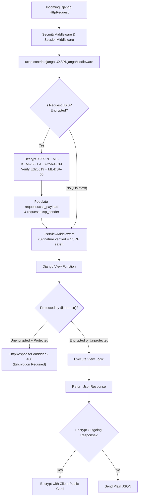

# Django Middleware & Protection Guide

UXSP provides a native Django middleware (`UXSPDjangoMiddleware`) that transparently decrypts incoming Post-Quantum payloads, encrypts outgoing responses, participates in client negotiation, and protects against replay attacks.



---

## 1. Setting up the Middleware in `settings.py`

You do **not** need to add UXSP to `INSTALLED_APPS`. Simply insert `UXSPDjangoMiddleware` into `MIDDLEWARE`:

### Middleware Ordering (CRITICAL)

Place `UXSPDjangoMiddleware` **AFTER** `SecurityMiddleware` and `SessionMiddleware`, but **BEFORE** `CsrfViewMiddleware`:

```python
# settings.py

MIDDLEWARE = [
    'django.middleware.security.SecurityMiddleware',
    'django.contrib.sessions.middleware.SessionMiddleware',
    'django.middleware.common.CommonMiddleware',
    
    # ── PLACE UXSP HERE ──────────────────────────────────────────────────
    # Decrypts and cryptographically verifies the request BEFORE CSRF checking!
    'uxsp.contrib.django.UXSPDjangoMiddleware',
    # ─────────────────────────────────────────────────────────────────────
    
    'django.middleware.csrf.CsrfViewMiddleware',
    'django.contrib.auth.middleware.AuthenticationMiddleware',
    'django.contrib.messages.middleware.MessageMiddleware',
    'django.middleware.clickjacking.XFrameOptionsMiddleware',
]
```

### Why Place UXSP Before CSRF Middleware?
Because UXSP inherently supersedes CSRF tokens! Every UXSP request is authenticated with digital signatures (Ed25519 + ML-DSA-65) and fresh nonces tied to the sender's cryptographic identity. Decrypting the payload before `CsrfViewMiddleware` ensures Django recognizes legitimate encrypted API calls without complaining about missing CSRF cookies.

---

## 2. Server Configuration in `settings.py`

Add the following configuration options to your `settings.py`:

```python
# settings.py
from uxsp.core.identity import Identity
import os

# Option A: Generate ephemeral server identity for development
UXSP_SERVER_IDENTITY = Identity.create("DjangoBackend", role="SERVER")

# Option B: Load persistent server identity in production
# KEY_PASSWORD = os.environ["UXSP_SERVER_PASSWORD"]
# UXSP_SERVER_IDENTITY = Identity.load("/etc/uxsp/server.uxsp", KEY_PASSWORD)

# Optional settings:
UXSP_REQUIRE_ENCRYPTION = False  # Set to True to mandate UXSP across ALL endpoints
UXSP_EXCLUDE_PATHS = ["/admin/", "/static/", "/healthz", "/api/card"]
UXSP_MAX_REQUEST_SIZE = 16 * 1024 * 1024  # 16 MB limit
```

---

## 3. Writing Django Views (`views.py` & `urls.py`)

### Example `views.py`
```python
from django.http import JsonResponse, HttpResponse
from django.conf import settings
from uxsp.contrib.django import protect

def server_card_view(request):
    """Exposes the server's public card so clients can encrypt messages."""
    card_dict = settings.UXSP_SERVER_IDENTITY.public_card().to_dict()
    return JsonResponse(card_dict)

def hybrid_echo_view(request):
    """Accessible via plain JSON or Post-Quantum encrypted UXSP."""
    if hasattr(request, "uxsp_payload") and request.uxsp_payload is not None:
        return JsonResponse({
            "status": "decrypted",
            "sender": request.uxsp_sender,
            "data": request.uxsp_payload
        })
    
    # Plain text fallback
    import json
    body = json.loads(request.body or "{}")
    return JsonResponse({"status": "plaintext", "data": body})

@protect()
def secure_transfer_view(request):
    """Strictly protected view: Rejects unencrypted requests with HTTP 400!"""
    # Guaranteed to be cryptographically authenticated and decrypted:
    payload = request.uxsp_payload
    sender_id = request.uxsp_sender
    
    account = payload.get("account")
    amount = payload.get("amount")
    
    # Returning a standard JsonResponse will be automatically encrypted 
    # by UXSPDjangoMiddleware before departing the server!
    return JsonResponse({
        "status": "APPROVED",
        "sender": sender_id,
        "account": account,
        "amount": amount
    })
```

### Example `urls.py`
```python
from django.urls import path
from . import views

urlpatterns = [
    path("api/card", views.server_card_view, name="server_card"),
    path("api/echo", views.hybrid_echo_view, name="hybrid_echo"),
    path("api/transfer", views.secure_transfer_view, name="secure_transfer"),
]
```

---

## 4. Testing the Django Endpoints

### Test 1: Calling Protected View Without Encryption
```bash
curl -X POST http://localhost:8000/api/transfer \
     -H "Content-Type: application/json" \
     -d '{"account": "1001", "amount": 2500}'
```
*Output:*
```text
HTTP 400 Bad Request: UXSP encryption required
```

### Test 2: Calling With UXSP Python Client
```python
from uxsp.client import UXSPClient
from uxsp.core.identity import Identity

alice = Identity.create("AliceClient", role="CLIENT")

with UXSPClient(identity=alice) as client:
    response = client.post("http://localhost:8000/api/transfer", json={
        "account": "1001",
        "amount": 2500
    })
    print("Decrypted Response:", response.json())
```
*Output:*
```text
Decrypted Response: {'status': 'APPROVED', 'sender': 'AliceClient', 'account': '1001', 'amount': 2500}
```

---

## 5. Scaling with Redis KeyStore in Production

If your Django application runs on multiple Gunicorn or uWSGI workers, configure a shared Redis KeyStore:

```python
# settings.py
import redis
from uxsp.storage.keystore import RedisKeyStore
from uxsp.storage.noncestore import RedisNonceStore

_redis = redis.Redis.from_url(os.environ.get("REDIS_URL", "redis://localhost:6379/0"))

UXSP_KEYSTORE = RedisKeyStore(_redis)
UXSP_NONCESTORE = RedisNonceStore(_redis)
```
