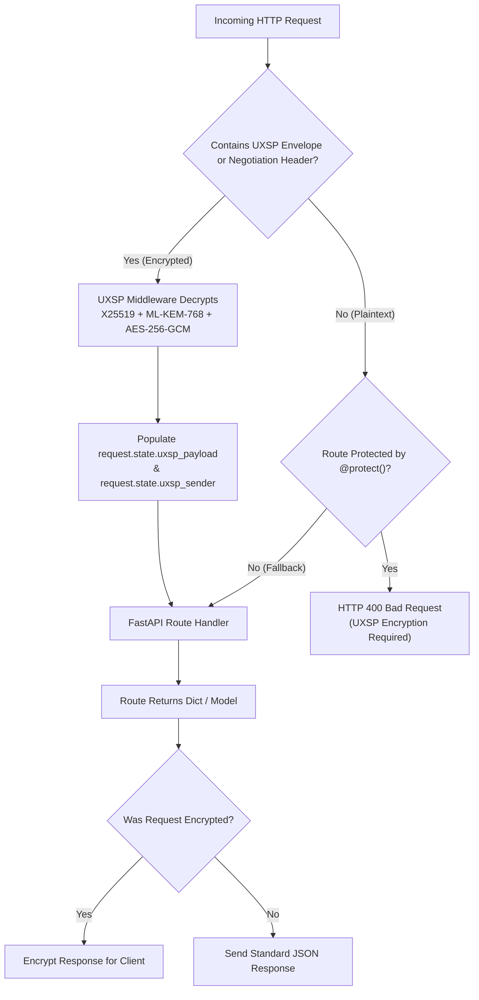

# FastAPI Middleware & Protection Guide

UXSP provides a native ASGI middleware (`UXSPFastAPIMiddleware`) for **FastAPI** and **Starlette**. It transparently decrypts incoming Post-Quantum payloads, encrypts outgoing responses, participates in automatic client negotiation, and protects your endpoints against replay attacks.



---

## 1. Complete Runnable FastAPI Server

Here is a complete, production-ready FastAPI application:

```python
from fastapi import FastAPI, Request
from uxsp.core.identity import Identity
from uxsp.contrib.fastapi import UXSPFastAPIMiddleware, protect
from uxsp.storage.keystore import MemoryKeyStore

# 1. Initialize Server Identity (or load from disk: Identity.load("server.uxsp", "password"))
server_identity = Identity.create("PaymentAPI", role="SERVER")

# 2. Initialize optional KeyStore for known client cards
keystore = MemoryKeyStore()

app = FastAPI(title="UXSP Protected API", version="1.3.1")

# 3. Add UXSP ASGI Middleware
app.add_middleware(
    UXSPFastAPIMiddleware,
    identity=server_identity,
    keystore=keystore,
    fallback=True,  # Allows plain HTTP for Swagger docs and unencrypted webhooks
    exclude_paths=["/docs", "/openapi.json", "/redoc", "/api/card"]
)

# 4. Expose Server's Public Card so Web & Mobile clients can fetch it
@app.get("/api/card")
async def get_server_card():
    """Returns the server's public card (X25519 + ML-KEM-768 public keys)."""
    return server_identity.public_card().to_dict()

# 5. Hybrid Endpoint (Accessible via plain JSON or UXSP Encrypted)
@app.post("/api/echo")
async def echo_data(request: Request):
    # If encrypted, request.state.uxsp_payload contains the decrypted dict/data.
    # If plain JSON, request.state.uxsp_payload is None and request.json() works.
    if getattr(request.state, "uxsp_payload", None) is not None:
        data = request.state.uxsp_payload
        sender = request.state.uxsp_sender
        return {"mode": "uxsp_encrypted", "sender": sender, "received": data}
    
    plain_json = await request.json()
    return {"mode": "plaintext", "received": plain_json}

# 6. Strictly Protected Endpoint (Mandates Post-Quantum Encryption!)
@app.post("/api/vault/transfer")
@protect()  # Rejects unencrypted plain JSON with HTTP 400!
async def confidential_transfer(request: Request):
    # Guaranteed to be decrypted and cryptographically verified
    payload = request.state.uxsp_payload
    sender_id = request.state.uxsp_sender
    
    print(f"Processing confidential transfer for {sender_id}: {payload}")
    
    # Returning a standard Python dictionary will be automatically
    # encrypted by the middleware before leaving the server!
    return {
        "status": "APPROVED",
        "tx_id": "tx_99281729",
        "processed_amount": payload.get("amount")
    }

if __name__ == "__main__":
    import uvicorn
    uvicorn.run(app, host="0.0.0.0", port=8000)
```

---

## 2. Testing the Server

### Test 1: Public Card Discovery
```bash
curl http://localhost:8000/api/card
```
*Returns the server's public card JSON.*

### Test 2: Plain HTTP Fallback on Hybrid Route
```bash
curl -X POST http://localhost:8000/api/echo \
     -H "Content-Type: application/json" \
     -d '{"message": "Hello via Plain HTTP"}'
```
*Output:*
```json
{"mode": "plaintext", "received": {"message": "Hello via Plain HTTP"}}
```

### Test 3: Calling Strictly Protected Route Without Encryption
```bash
curl -X POST http://localhost:8000/api/vault/transfer \
     -H "Content-Type: application/json" \
     -d '{"account": "1001", "amount": 5000}'
```
*Output:*
```json
{"detail": "UXSP encryption required"}
```
*(HTTP 400 rejection &mdash; unauthorized plaintext access prevented!)*

### Test 4: Calling With UXSP Python Client
```python
import asyncio
from uxsp.client import AsyncUXSPClient
from uxsp.core.identity import Identity

async def main():
    alice = Identity.create("AliceClient", role="CLIENT")
    async with AsyncUXSPClient(identity=alice) as client:
        # Automatic key discovery and Post-Quantum encryption
        response = await client.post("http://localhost:8000/api/vault/transfer", json={
            "account": "1001",
            "amount": 5000
        })
        print("Decrypted Response:", response.json())

asyncio.run(main())
```
*Output:*
```text
Decrypted Response: {'status': 'APPROVED', 'tx_id': 'tx_99281729', 'processed_amount': 5000}
```

---

## 3. Scaling with Redis KeyStore & NonceStore in Production

In production clusters with multiple FastAPI worker processes (`uvicorn -w 4`), use **Redis** or **PostgreSQL** to share peer public keys and replay prevention nonces:

```python
import redis
from uxsp.storage.keystore import RedisKeyStore
from uxsp.storage.noncestore import RedisNonceStore

# Connect to production Redis cluster
r = redis.Redis(host="redis.internal", port=6379, db=0)

redis_keystore = RedisKeyStore(r)
redis_noncestore = RedisNonceStore(r)

app.add_middleware(
    UXSPFastAPIMiddleware,
    identity=server_identity,
    keystore=redis_keystore,
    noncestore=redis_noncestore
)
```

---

## 4. Key Configuration Parameters

| Parameter | Type | Default | Description |
| :--- | :--- | :--- | :--- |
| `identity` | `Identity` | Global Context | The server's cryptographic identity holding private keys. |
| `keystore` | `KeyStore` | `None` | KeyStore used to lookup client public cards by entity ID. |
| `fallback` | `bool` | `True` | If `True`, permits plaintext HTTP for legacy clients. If `False`, enforces UXSP globally. |
| `exclude_paths` | `list[str]` | `["/docs", ...]` | Path prefixes that bypass cryptographic processing. |
| `max_request_size` | `int` | `16777216` (16MB) | Maximum body size in bytes before returning HTTP 413. |

