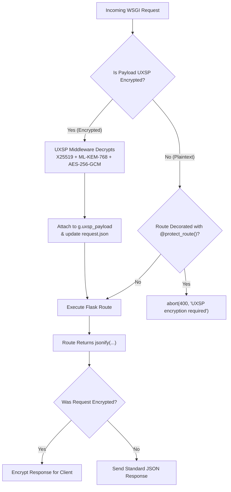

# Flask Middleware & Protection Guide

UXSP provides a native WSGI extension/middleware (`UXSPFlaskMiddleware`) for **Flask**. It transparently decrypts incoming Post-Quantum payloads, encrypts outgoing responses, participates in client negotiation, and protects against replay attacks.



---

## 1. Complete Runnable Flask Application

Here is a complete, production-ready Flask server:

```python
from flask import Flask, request, jsonify, g
from uxsp.core.identity import Identity
from uxsp.contrib.flask import UXSPFlaskMiddleware, protect_route
from uxsp.storage.keystore import MemoryKeyStore

app = Flask(__name__)

# 1. Initialize Server Identity
server_identity = Identity.create("FlaskPaymentAPI", role="SERVER")

# 2. KeyStore for resolving known client public cards
keystore = MemoryKeyStore()

# 3. Initialize UXSP Middleware / Extension
uxsp_ext = UXSPFlaskMiddleware(
    app,
    identity=server_identity,
    keystore=keystore,
    fallback=True,  # Allows plain HTTP for health checks and unencrypted endpoints
    exclude_paths=["/static", "/api/card"]
)

# 4. Public Card Discovery Endpoint
@app.route("/api/card", methods=["GET"])
def get_card():
    """Returns the server's public card (X25519 + ML-KEM-768 public keys)."""
    return jsonify(server_identity.public_card().to_dict())

# 5. Hybrid Endpoint (Accessible via Plaintext or UXSP Encrypted)
@app.route("/api/echo", methods=["POST"])
def echo_route():
    # If encrypted, g.uxsp_payload contains the verified dictionary
    if getattr(g, "uxsp_payload", None) is not None:
        return jsonify({
            "mode": "uxsp_encrypted",
            "sender": getattr(g, "uxsp_sender", "anonymous"),
            "data": g.uxsp_payload
        })
    
    # Standard plaintext JSON fallback
    return jsonify({
        "mode": "plaintext",
        "data": request.get_json(silent=True) or {}
    })

# 6. Strictly Protected Endpoint (Mandates Post-Quantum Encryption!)
@app.route("/api/checkout", methods=["POST"])
@protect_route()  # Rejects unencrypted plain JSON with HTTP 400!
def secure_checkout():
    # Guaranteed to be cryptographically verified and decrypted:
    payload = g.uxsp_payload
    sender = getattr(g, "uxsp_sender", None)
    
    cart_id = payload.get("cartId")
    total = payload.get("total")
    
    # Returning standard jsonify(...) will be intercepted by the middleware
    # and encrypted with the client's public keys before sending!
    return jsonify({
        "status": "PAID",
        "cartId": cart_id,
        "charged": total,
        "processed_by": "UXSP_Protected_Backend"
    })

if __name__ == "__main__":
    app.run(host="0.0.0.0", port=5000, debug=True)
```

---

## 2. Testing the Flask Endpoints

### Test 1: Calling Protected Route Without Encryption
```bash
curl -X POST http://localhost:5000/api/checkout \
     -H "Content-Type: application/json" \
     -d '{"cartId": "c_991", "total": 120.50}'
```
*Output:*
```text
HTTP 400 Bad Request: UXSP encryption required
```

### Test 2: Calling With UXSP Python Client
```python
from uxsp.client import UXSPClient
from uxsp.core.identity import Identity

alice = Identity.create("AliceClient", role="CLIENT")

with UXSPClient(identity=alice) as client:
    # Autonomous discovery and hybrid post-quantum encryption
    response = client.post("http://localhost:5000/api/checkout", json={
        "cartId": "c_991",
        "total": 120.50
    })
    print("Decrypted Response:", response.json())
```
*Output:*
```text
Decrypted Response: {'status': 'PAID', 'cartId': 'c_991', 'charged': 120.5, 'processed_by': 'UXSP_Protected_Backend'}
```

---

## 3. Scaling with Redis KeyStore & NonceStore in Production

In multi-threaded or multi-worker Gunicorn deployments:

```python
import redis
from uxsp.storage.keystore import RedisKeyStore
from uxsp.storage.noncestore import RedisNonceStore

r = redis.Redis(host="localhost", port=6379, db=0)

UXSPFlaskMiddleware(
    app,
    identity=server_identity,
    keystore=RedisKeyStore(r),
    noncestore=RedisNonceStore(r)
)
```

---

## 4. Key Configuration Parameters

| Parameter | Type | Default | Description |
| :--- | :--- | :--- | :--- |
| `app` | `Flask` | Required | The Flask application instance. |
| `identity` | `Identity` | Global Context | The server's identity holding private keys. |
| `keystore` | `KeyStore` | `None` | KeyStore used to resolve client public cards by entity ID. |
| `fallback` | `bool` | `True` | If `True`, permits plaintext HTTP on unprotected routes. If `False`, mandates UXSP globally. |
| `exclude_paths` | `list[str]` | `["/static"]` | Path prefixes that bypass cryptographic processing. |
| `max_request_size` | `int` | `16777216` (16MB) | Maximum request body size in bytes before rejecting with HTTP 413. |
