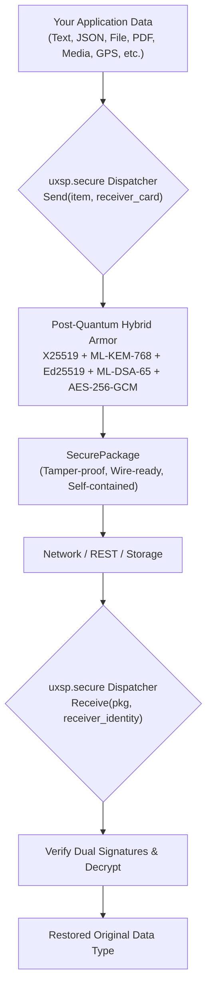

# High-Level APIs (`uxsp.secure`)

The `uxsp.secure` module provides 1-line cryptographic operations across **14 distinct polymorphic data types**. It eliminates cryptographic boilerplate: you don't need to manually orchestrate IV generation, KEM encapsulation, digital signatures, or AEAD tag verification.



---

## 1. Identity Setup & Context Management

Before sending or receiving data, you establish cryptographic identities.

### `create_identity(entity_id, role="CLIENT")`
* **What is it?** Generates an ephemeral or persistent `Identity` containing hybrid classical and post-quantum keypairs.
* **When to use?** At application startup or during user registration.
* **How to use:**
  ```python
  from uxsp.secure import create_identity

  # Create an identity for Alice
  alice = create_identity(entity_id="AliceClient", role="CLIENT")
  # Extract shareable public card
  alice_card = alice.public_card()
  ```
* **How it works:** Generates 4 cryptographic keys simultaneously: an X25519 private key, an Ed25519 signing key, an ML-KEM-768 decapsulation key, and an ML-DSA-65 signing key.

### `export_identity_encrypted(identity, path, password)` & `import_identity_encrypted(path, password)`
* **What is it?** Saves and restores an identity encrypted with password-derived Argon2id + AES-256-GCM.
* **When to use?** Storing server or client private keys safely on disk.
* **How to use:**
  ```python
  from uxsp.secure import export_identity_encrypted, import_identity_encrypted

  # Save encrypted to disk
  export_identity_encrypted(alice, "alice.uxsp", "MySecretPassword123")

  # Load from disk on next restart
  restored_alice = import_identity_encrypted("alice.uxsp", "MySecretPassword123")
  ```

### `configure(identity=None, keystore=None, nonce_store=None)` & `set_identity(identity)`
* **What is it?** Registers default identities, KeyStores, and NonceStores globally across the process.
* **When to use?** At backend startup so subsequent `Send*` and `Receive*` calls don't need explicit credentials passed each time.
* **How to use:**
  ```python
  from uxsp.secure import configure, set_identity

  configure(identity=alice)
  # or: set_identity(alice)
  ```

---

## 2. The Universal Polymorphic Entry Points: `Send()` and `Receive()`

If you do not want to choose a type-specific function, `Send()` automatically detects the data type, sniffs MIME types, and dispatches to the correct handler.

```python
from uxsp.secure import Send, Receive

# Automatically detects str -> Text, dict -> JSON, bytes -> Binary, Path -> File
pkg = Send("Confidential Message", receiver=bob_card, sender=alice)

# Automatically extracts and returns the original type:
result = Receive(pkg, receiver=bob)
print("Decrypted:", result)  # Output: "Confidential Message"
```

---

## 3. The 14 Polymorphic Data Type APIs

Each API below is dedicated to a specific data format with type-specific validation, MIME enforcement, and metadata preservation.

### 3.1 Text: `SendText` / `ReceiveText`
* **What is it?** Encrypts and decrypts UTF-8 string messages.
* **When to use?** Chat messages, notifications, authentication tokens, status updates.
* **How to use:**
  ```python
  from uxsp.secure import SendText, ReceiveText

  pkg = SendText("Order #9928 authorized", receiver_card=bob_card, sender_identity=alice)
  text = ReceiveText(pkg, receiver_identity=bob)
  print(text)  # "Order #9928 authorized"
  ```
* **How it works:** Encodes string to UTF-8, encapsulates hybrid keys, computes AES-256-GCM ciphertext, dual-signs with Ed25519 + ML-DSA-65, and returns a `SecurePackage`.

---

### 3.2 JSON & Dictionaries: `SendJSON` / `ReceiveJSON`
* **What is it?** Serializes Python dictionaries and lists, encrypts the canonical JSON payload, and returns the deserialized structure upon decryption.
* **When to use?** REST API payloads, database record synchronization, structured events.
* **How to use:**
  ```python
  from uxsp.secure import SendJSON, ReceiveJSON

  data = {"account_id": "acc_402", "balance": 15000.50, "verified": True}
  pkg = SendJSON(data, receiver_card=bob_card, sender_identity=alice)

  decrypted_dict = ReceiveJSON(pkg, receiver_identity=bob)
  print(decrypted_dict["balance"])  # 15000.50
  ```
* **How it works:** Sorts keys canonically, dumps to compact UTF-8 JSON, encrypts with authenticated Associated Data, and automatically calls `json.loads` upon receipt.

---

### 3.3 Raw Binary: `SendBinary` / `ReceiveBinary`
* **What is it?** Encrypts arbitrary raw byte buffers (`bytes` or `bytearray`).
* **When to use?** Hardware sensor readings, raw Protobuf buffers, encrypted session tokens, custom binary formats.
* **How to use:**
  ```python
  from uxsp.secure import SendBinary, ReceiveBinary

  raw_bytes = b"\x00\xFF\xAA\x55\xDE\xAD\xBE\xEF"
  pkg = SendBinary(raw_bytes, receiver_card=bob_card, sender_identity=alice)

  recovered_bytes = ReceiveBinary(pkg, receiver_identity=bob)
  assert recovered_bytes == raw_bytes
  ```
* **How it works:** Bypasses string encoding, directly passing bytes to the symmetric AEAD cipher with zero copy overhead.

---

### 3.4 Files: `SendFile` / `ReceiveFile`
* **What is it?** Encrypts a file from disk, preserving its original filename, size, and MIME type metadata.
* **When to use?** Secure file uploads, encrypted attachments, document distribution.
* **How to use:**
  ```python
  from uxsp.secure import SendFile, ReceiveFile

  # Sender encrypts a local file
  pkg = SendFile("report.docx", receiver_card=bob_card, sender_identity=alice)

  # Receiver decrypts and saves back to disk
  saved_path = ReceiveFile(pkg, output_path="downloaded_report.docx", receiver_identity=bob)
  print(f"File saved to: {saved_path}")
  ```
* **How it works:** Reads binary content from disk, embeds metadata (filename, byte size, timestamp) inside the encrypted envelope, and verifies integrity before writing to `output_path`.

---

### 3.5 PDF Documents: `SendPDF` / `ReceivePDF`
* **What is it?** Specialized handler for Portable Document Format (`.pdf`) files with PDF header validation (`%PDF-`).
* **When to use?** Invoices, medical records, signed legal contracts, tax documents.
* **How to use:**
  ```python
  from uxsp.secure import SendPDF, ReceivePDF

  pkg = SendPDF("contract.pdf", receiver_card=bob_card, sender_identity=alice)
  pdf_path = ReceivePDF(pkg, output_path="verified_contract.pdf", receiver_identity=bob)
  ```
* **How it works:** Verifies the PDF magic bytes (`%PDF-`) prior to sealing to prevent file format spoofing.

---

### 3.6 Documents: `SendDocument` / `ReceiveDocument` (Alias: `SendDoc` / `ReceiveDoc`)
* **What is it?** Handler for office documents (Word `.docx`, Excel `.xlsx`, PowerPoint `.pptx`, Markdown `.md`, Text `.txt`).
* **When to use?** Business document workflows, collaborative text sharing.
* **How to use:**
  ```python
  from uxsp.secure import SendDocument, ReceiveDocument

  pkg = SendDocument("financials.xlsx", receiver_card=bob_card, sender_identity=alice)
  doc_path = ReceiveDocument(pkg, output_path="restored_financials.xlsx", receiver_identity=bob)
  ```

---

### 3.7 Photos & Images: `SendPhoto` / `ReceivePhoto` (Alias: `SendImage` / `ReceiveImage`)
* **What is it?** Encrypts image formats (`.jpg`, `.png`, `.webp`, `.tiff`, `.bmp`) with image dimension and format preservation.
* **When to use?** User profile photos, KYC passport/ID card verification, biometric capture.
* **How to use:**
  ```python
  from uxsp.secure import SendPhoto, ReceivePhoto

  pkg = SendPhoto("id_card.png", receiver_card=bob_card, sender_identity=alice)
  img_path = ReceivePhoto(pkg, output_path="verified_id.png", receiver_identity=bob)
  ```

---

### 3.8 Video: `SendVideo` / `ReceiveVideo`
* **What is it?** Encrypts standard video containers (`.mp4`, `.mov`, `.mkv`, `.webm`).
* **When to use?** CCTV camera uploads, encrypted video messages, KYC video verification clips.
* **How to use:**
  ```python
  from uxsp.secure import SendVideo, ReceiveVideo

  pkg = SendVideo("cctv_clip.mp4", receiver_card=bob_card, sender_identity=alice)
  video_path = ReceiveVideo(pkg, output_path="decrypted_clip.mp4", receiver_identity=bob)
  ```

---

### 3.9 Audio & Voice: `SendAudio` / `ReceiveAudio` (Alias: `SendVoice` / `ReceiveVoice`)
* **What is it?** Encrypts audio recordings and voice notes (`.opus`, `.aac`, `.mp3`, `.wav`, `.m4a`).
* **When to use?** Encrypted voice memos, call recordings, acoustic sensor logs.
* **How to use:**
  ```python
  from uxsp.secure import SendVoice, ReceiveVoice

  pkg = SendVoice("voicenote.opus", receiver_card=bob_card, sender_identity=alice)
  audio_path = ReceiveVoice(pkg, output_path="saved_voicenote.opus", receiver_identity=bob)
  ```

---

### 3.10 Geolocation: `SendLocation` / `ReceiveLocation`
* **What is it?** Encrypts latitude, longitude, altitude, accuracy, and timestamp tuples.
* **When to use?** Real-time GPS tracking, ride-sharing coordinates, delivery fleet security.
* **How to use:**
  ```python
  from uxsp.secure import SendLocation, ReceiveLocation

  # Sender sends coordinates
  pkg = SendLocation(
      latitude=37.7749,
      longitude=-122.4194,
      altitude=15.0,
      accuracy=2.5,
      receiver_card=bob_card,
      sender_identity=alice
  )

  # Receiver gets structured location dict
  loc = ReceiveLocation(pkg, receiver_identity=bob)
  print(f"Latitude: {loc['latitude']}, Longitude: {loc['longitude']}")
  ```
* **How it works:** Bounds coordinate precision and cryptographically signs GPS telemetry so location spoofing is impossible.

---

### 3.11 Contacts & vCards: `SendContact` / `ReceiveContact`
* **What is it?** Encrypts contact cards containing name, phone, email, and organization.
* **When to use?** Secure contact exchange, corporate directory synchronization.
* **How to use:**
  ```python
  from uxsp.secure import SendContact, ReceiveContact

  contact_info = {
      "name": "Dr. Aris Thorne",
      "phone": "+1-555-0199",
      "email": "aris@quantum.lab",
      "org": "Quantum Research Institute"
  }
  pkg = SendContact(contact_info, receiver_card=bob_card, sender_identity=alice)
  contact = ReceiveContact(pkg, receiver_identity=bob)
  print(contact["name"], contact["email"])
  ```

---

### 3.12 HTML Payloads: `SendHTML` / `ReceiveHTML`
* **What is it?** Encrypts rich HTML documents and email templates.
* **When to use?** End-to-end encrypted emails, confidential web reports, rendered dashboards.
* **How to use:**
  ```python
  from uxsp.secure import SendHTML, ReceiveHTML

  html_markup = "<h1>Confidential Financial Summary</h1><p>Q3 Revenue: $42M</p>"
  pkg = SendHTML(html_markup, receiver_card=bob_card, sender_identity=alice)
  rendered_html = ReceiveHTML(pkg, receiver_identity=bob)
  ```

---

### 3.13 Compressed Archives: `SendArchive` / `ReceiveArchive` (Alias: `SendZip` / `ReceiveZip`)
* **What is it?** Encrypts compressed tarballs and archives (`.zip`, `.tar.gz`, `.tar.bz2`, `.7z`).
* **When to use?** Folder synchronization, software package distribution, database snapshots.
* **How to use:**
  ```python
  from uxsp.secure import SendArchive, ReceiveArchive

  pkg = SendArchive("project_backup.tar.gz", receiver_card=bob_card, sender_identity=alice)
  archive_path = ReceiveArchive(pkg, output_path="restored_backup.tar.gz", receiver_identity=bob)
  ```

---

### 3.14 Live Voice Calls: `SendLiveVoiceCall` / `ReceiveLiveVoiceCall`
* **What is it?** Seals a real-time call initiation payload containing session SDP, candidate keys, and ratcheting parameters.
* **When to use?** Initializing an end-to-end encrypted voice/video call session before media frames begin streaming.
* **How to use:**
  ```python
  from uxsp.secure import SendLiveVoiceCall, ReceiveLiveVoiceCall

  call_metadata = {
      "call_id": "call_7718",
      "codec": "opus",
      "sample_rate": 48000,
      "channels": 2
  }
  pkg = SendLiveVoiceCall(call_metadata, receiver_card=bob_card, sender_identity=alice)
  call_params = ReceiveLiveVoiceCall(pkg, receiver_identity=bob)
  print("Call initialized with codec:", call_params["codec"])
  ```

---

## 4. Working with `SecurePackage`

All `Send*` functions return a `SecurePackage`. This object encapsulates the complete cryptographic envelope and offers serialization methods:

```python
# 1. Convert to Python Dictionary (for FastAPI / Flask JSON responses)
pkg_dict = pkg.to_dict()

# 2. Convert to compact JSON string (for sending over HTTP body)
json_string = pkg.to_json()

# 3. Convert to Raw Wire Bytes (for TCP / WebSockets / UDP)
wire_bytes = pkg.to_bytes()

# 4. Reconstruct from JSON string
from uxsp.secure import SecurePackage
reconstructed_pkg = SecurePackage.from_json(json_string)

# 5. Inspect package metadata safely without decrypting
print(f"Package Type: {pkg.content_type}")
print(f"Sender ID   : {pkg.sender_id}")
print(f"Timestamp   : {pkg.timestamp}")
```

---

## 5. Summary Table of `uxsp.secure` APIs

| Data Type | Send Function | Receive Function | Input Type | Output Type |
| :--- | :--- | :--- | :--- | :--- |
| **Generic** | `Send()` | `Receive()` | Any supported | Auto-detected original |
| **Text** | `SendText()` | `ReceiveText()` | `str` | `str` |
| **JSON** | `SendJSON()` | `ReceiveJSON()` | `dict` / `list` | `dict` / `list` |
| **Binary** | `SendBinary()` | `ReceiveBinary()` | `bytes` | `bytes` |
| **File** | `SendFile()` | `ReceiveFile()` | Path / filename | Path to saved file |
| **PDF** | `SendPDF()` | `ReceivePDF()` | PDF path | Path to saved PDF |
| **Document** | `SendDocument()` | `ReceiveDocument()` | Office doc path | Path to saved doc |
| **Photo** | `SendPhoto()` | `ReceivePhoto()` | Image path | Path to saved image |
| **Video** | `SendVideo()` | `ReceiveVideo()` | Video path | Path to saved video |
| **Voice** | `SendVoice()` | `ReceiveVoice()` | Audio path | Path to saved audio |
| **Location** | `SendLocation()` | `ReceiveLocation()` | Float coordinates | Coordinate dict |
| **Contact** | `SendContact()` | `ReceiveContact()` | Contact dict | Contact dict |
| **HTML** | `SendHTML()` | `ReceiveHTML()` | HTML string | HTML string |
| **Archive** | `SendArchive()` | `ReceiveArchive()` | Zip/Tar path | Path to saved archive |
| **Voice Call**| `SendLiveVoiceCall()` | `ReceiveLiveVoiceCall()` | Call config dict | Call config dict |
