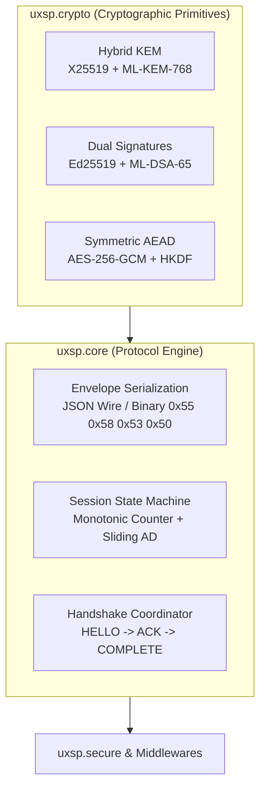

# Low-Level APIs & Core Cryptography Guide

While the high-level `uxsp.secure` APIs handle 99% of web applications in 1 line of code, the low-level modules (`uxsp.core` and `uxsp.crypto`) provide direct access to the underlying cryptographic primitives, envelope serializers, and handshake state machines.



---

## 1. Direct Hybrid Key Encapsulation (ML-KEM + X25519)

In UXSP, key exchange is double-locked: even if quantum computers crack the elliptic-curve discrete log problem, the ML-KEM-768 lattice protects the master secret.

```python
from uxsp.core.identity import Identity
from uxsp.crypto.hybrid import hybrid_encapsulate, hybrid_decapsulate

# 1. Create recipient identity holding hybrid private keys
bob = Identity.create("Bob", role="SERVER")
bob_card = bob.public_card()

# 2. Sender (Alice) performs Hybrid Encapsulation against Bob's PublicCard:
# Returns:
# - shared_secret: 32 cryptographically strong bytes derived via HKDF-SHA256
# - ephemeral_pub: Alice's 32-byte ephemeral X25519 public key
# - kem_ciphertext: 1088 bytes of ML-KEM-768 ciphertext
shared_secret_sender, eph_pub, kem_ct = hybrid_encapsulate(bob_card)

print(f"Derived Master Secret (Sender): {shared_secret_sender.hex()[:32]}...")
print(f"Ephemeral X25519 Key Length  : {len(eph_pub)} bytes")
print(f"ML-KEM-768 Ciphertext Length : {len(kem_ct)} bytes")

# 3. Recipient (Bob) Decapsulates using his private keys:
shared_secret_receiver = hybrid_decapsulate(
    recipient_identity=bob,
    ephemeral_public_key=eph_pub,
    kem_ciphertext=kem_ct
)

assert shared_secret_sender == shared_secret_receiver
print("Both parties independently derived the IDENTICAL shared secret!")
```

---

## 2. Direct Dual Classical & Post-Quantum Signatures

To ensure authentication and non-repudiation, every envelope is signed twice: once with classical **Ed25519** (RFC 8032) and once with NIST **ML-DSA-65** (FIPS 204).

```python
from uxsp.core.identity import Identity
from uxsp.core.signing import DualSigner, DualVerifier

alice = Identity.create("Alice", role="CLIENT")
message = b"CRITICAL_INSTRUCTION: Approve Transaction #4892"

# 1. Sign with Alice's private keys
signer = DualSigner(alice)
signatures = signer.sign(message)

print(f"Ed25519 Signature Length: {len(signatures.classical_signature)} bytes (64B)")
print(f"ML-DSA-65 Signature Length: {len(signatures.pqc_signature)} bytes (3309B)")

# 2. Verify with Alice's PublicCard
verifier = DualVerifier(alice.public_card())
is_valid = verifier.verify(message, signatures)
print(f"Dual Signature Valid: {is_valid}")

# 3. Tamper detection:
tampered_message = b"CRITICAL_INSTRUCTION: Approve Transaction #9999"
assert not verifier.verify(tampered_message, signatures)
print("Tampered payload successfully rejected!")
```

---

## 3. Manual Envelope Construction & Serialization

If you are implementing custom binary network protocols (e.g. raw TCP, UDP, or zero-mq sockets), you can construct and serialize the raw `Envelope` directly:

```python
from uxsp.core.envelope import Envelope
from uxsp.core.identity import Identity
from uxsp.crypto.hybrid import hybrid_encapsulate
from uxsp.crypto.symmetric import aes_gcm_encrypt
from uxsp.core.signing import DualSigner
import time

alice = Identity.create("Alice", role="CLIENT")
bob = Identity.create("Bob", role="SERVER")

# 1. Hybrid Key Exchange
shared_key, eph_pub, kem_ct = hybrid_encapsulate(bob.public_card())

# 2. Symmetric AEAD Encryption
plaintext = b'{"command": "REBOOT_NODE", "node_id": "us-east-1"}'
ciphertext, nonce, tag = aes_gcm_encrypt(key=shared_key, plaintext=plaintext)

# 3. Dual-Sign the ciphertext and metadata
signer = DualSigner(alice)
sigs = signer.sign(ciphertext)

# 4. Construct the Envelope
envelope = Envelope(
    sender_id=alice.entity_id,
    recipient_id=bob.entity_id,
    ephemeral_pub=eph_pub,
    kem_ciphertext=kem_ct,
    ciphertext=ciphertext,
    nonce=nonce,
    tag=tag,
    classical_sig=sigs.classical_signature,
    pqc_sig=sigs.pqc_signature,
    timestamp=int(time.time()),
    envelope_nonce=Envelope.generate_nonce()
)

# Export to JSON Wire Format (application/uxsp+json)
json_wire_bytes = envelope.to_json_bytes()
print("JSON Wire Size:", len(json_wire_bytes), "bytes")

# Export to Bit-Level Binary Wire Format (UXSP/1 0x55 0x58 0x53 0x50)
binary_wire_bytes = envelope.to_binary()
print("Binary Wire Size:", len(binary_wire_bytes), "bytes")
```

---

## 4. Low-Level 3-Way Handshake (`HandshakeManager`)

For stateful channels requiring directional session keys and replay sliding windows:

```python
from uxsp.core.handshake import HandshakeInitiator, HandshakeResponder
from uxsp.core.identity import Identity

alice = Identity.create("Alice", role="CLIENT")
bob = Identity.create("Bob", role="SERVER")

# Step 1: Alice creates HELLO frame
initiator = HandshakeInitiator(alice, bob.public_card())
hello_frame = initiator.create_hello()

# Step 2: Bob processes HELLO and creates ACK frame
responder = HandshakeResponder(bob)
ack_frame = responder.handle_hello(hello_frame)

# Step 3: Alice completes handshake and creates COMPLETE frame
complete_frame, alice_session = initiator.handle_ack(ack_frame)

# Step 4: Bob finalizes session
bob_session = responder.handle_complete(complete_frame)

# Both sessions are active with directional keys!
frame = alice_session.encrypt_data(b"Encrypted live telemetry data")
recovered = bob_session.decrypt_data(frame)
print("Recovered live frame:", recovered)
```

---

## 5. Summary of Core Modules

| Module | Class / Function | Purpose |
| :--- | :--- | :--- |
| `uxsp.crypto.hybrid` | `hybrid_encapsulate` | Double-lock KEM (X25519 + ML-KEM-768) |
| `uxsp.crypto.hybrid` | `hybrid_decapsulate` | Recipient decapsulation & HKDF derivation |
| `uxsp.core.signing` | `DualSigner`, `DualVerifier` | Ed25519 + ML-DSA-65 simultaneous signing |
| `uxsp.core.envelope` | `Envelope` | Wire protocol packaging & validation |
| `uxsp.core.handshake`| `HandshakeInitiator`, `HandshakeResponder` | 3-way mutual authentication state machine |
| `uxsp.core.session` | `SessionState` | Monotonic sequencing, directional keys, and rekeying |
