# Live Media & Streaming Architecture Guide (`uxsp.secure` & `uxsp.core.live`)

Streaming large media files or delivering sub-second real-time video/audio frames presents two unique cryptographic challenges:
1. **Memory Exhaustion (OOM)**: Loading a 50GB file into RAM to encrypt it crashes web servers. UXSP solves this using **Chunked Streaming** with strictly bounded `O(chunk_size)` memory.
2. **Serialization Latency**: Standard JSON envelopes (`SecurePackage`) add millisecond-scale parsing overhead that is unacceptable for 60 FPS video calls and CCTV feeds. UXSP solves this using **Zero-Parsing Symmetric Frame Encryption** (`LiveSession` & `LiveVoiceSession`).

---

## 🏛️ Streaming Architectures: Chunked vs. Real-Time Frame Pipes

```mermaid
flowchart TD
    subgraph ModeA ["1. Chunked File Streaming: SendStream / ReceiveStream"]
        FileSrc["Multi-Gigabyte File on Disk"] -->|"Iterate in 64KB Slices"| Chunker["Stream Engine"]
        Chunker -->|"Seals Individual Packages"| WireNet["Network Transport\n(WebSockets / HTTP Chunked / gRPC)"]
        WireNet -->|"Stream to Disk"| Dechunker["Dechunking Engine"]
        Dechunker -->|"O(chunk_size) Memory"| FileDst["Restored File on Disk"]
    end

    subgraph ModeB ["2. Ultra-Low Latency Real-Time: LiveSession"]
        Camera["Camera / Microphone / WebRTC Track"] -->|"Raw Video/Audio Frame"| LiveEnc["LiveSession.encrypt_frame()"]
        LiveEnc -->|"2-byte Len + Meta + Nonce + Ciphertext"| SFU["Zero-Knowledge SFU / Relay\n(inspects metadata only)"]
        SFU -->|"Sub-millisecond Forwarding"| LiveDec["LiveSession.decrypt_frame()"]
        LiveDec -->|"Zero-Parsing Render"| Display["Player / Speaker / Screen"]
    end
```



---

## 1. Multi-Gigabyte Chunked Streaming (`SendStream` & `ReceiveStream`)

When transferring large assets (virtual machine images, 4K video renders, database backups), traditional cryptographic systems load the entire file into memory to compute digital signatures.

UXSP's `SendStream` and `ReceiveStream` split payloads into bounded slices (default 64KB), independently encapsulating and authenticating each chunk.

### 1.1 Synchronous File Streaming to Disk
- **What is it?** Reads an arbitrary file from disk, encrypts it chunk-by-chunk, and writes line-delimited JSON envelopes directly to a target destination.
- **When to use?** When archiving large files or preparing them for batch network transfer.
- **How to use:**
```python
from pathlib import Path
import uxsp
from uxsp.secure import SendStream, ReceiveStream

def stream_file_archive(alice, bob_card, source_file: Path, encrypted_archive: Path, restored_file: Path):
    # 1. Stream-encrypt large file to disk with 64KB chunks
    SendStream(
        stream_or_path=source_file,
        receiver=bob_card,
        sender=alice,
        chunk_size=64 * 1024,
        output_destination=encrypted_archive
    )
    print("Stream encryption complete. Output written to:", encrypted_archive)

    # 2. Stream-decrypt from archive back to restored file
    ReceiveStream(
        packages_or_stream=encrypted_archive,
        output_file=restored_file,
        sender=alice.public_card(),
        receiver=bob_card  # or Bob's Identity
    )
    print("Stream decryption complete. File restored to:", restored_file)
```
- **Line-by-Line Explanation:**
  - `SendStream(...)`: Iterates over `source_file` in 64KB blocks, encrypts each block, and writes line-delimited JSON strings to `output_destination`.
  - `chunk_size=64 * 1024`: Bounds memory consumption so RAM usage never exceeds 64KB regardless of file size.
  - `ReceiveStream(...)`: Reads line-by-line from `encrypted_archive`, verifies signatures, and writes unencrypted bytes directly to `restored_file`.

---

### 1.2 In-Memory Iterator Streaming Over Network Sockets
- **What is it?** Yields individual `SecurePackage` objects chunk-by-chunk as a Python generator.
- **When to use?** When streaming data dynamically over custom TCP connections, HTTP chunked transfer responses, or message queues.
- **How to use:**
```python
import uxsp
from uxsp.secure import SendStream

def stream_over_socket(sock, alice, bob_card, data_stream_or_file):
    # Omitting output_destination returns a Generator yielding SecurePackage chunks
    for chunk_package in SendStream(
        stream_or_path=data_stream_or_file,
        chunk_size=32 * 1024,  # 32 KB chunks
        receiver=bob_card,
        sender=alice
    ):
        # Serialize chunk and send across socket
        wire_data = chunk_package.to_json().encode("utf-8") + b"\n"
        sock.sendall(wire_data)
        
    sock.sendall(b"STREAM_END\n")
```
- **Line-by-Line Explanation:**
  - `for chunk_package in SendStream(...)`: Slices input on the fly and yields each encrypted `SecurePackage`.
  - `wire_data = chunk_package.to_json().encode(...) + b"\n"`: Prepares newline-delimited stream packages.
  - `sock.sendall(...)`: Immediately transmits chunk over the socket without waiting for the full file to be processed.

---

### 1.3 Raw Binary Chunk Generators (`stream_send_chunks` & `stream_receive_chunks`)
- **What is it?** Low-level chunk helpers that divide binary buffers into numbered chunk packages and reassemble them.
- **When to use?** Custom microservice protocols where chunk numbers and total chunk counts must be tracked explicitly.
- **How to use:**
```python
from uxsp.secure import stream_send_chunks, stream_receive_chunks

def raw_chunk_demo(alice, bob_card):
    large_payload = b"UXSP_RAW_STREAMING_DATA" * 5000
    
    # 1. Chunk and encrypt
    chunk_list = list(stream_send_chunks(
        data_or_path=large_payload,
        chunk_size=8192,
        receiver=bob_card,
        sender=alice
    ))
    print(f"Generated {len(chunk_list)} encrypted chunks.")
    
    # 2. Reassemble and verify
    restored_bytes = stream_receive_chunks(
        chunk_packages=chunk_list,
        sender=alice.public_card(),
        receiver=alice
    )
    assert restored_bytes == large_payload
    print("Reassembly successful!")
```
- **Line-by-Line Explanation:**
  - `stream_send_chunks(...)`: Automatically embeds `stream_chunk_index` and `stream_total_chunks` into package metadata.
  - `stream_receive_chunks(...)`: Decrypts all chunks and verifies sequence ordering before concatenating bytes.

---

## 2. Real-Time Video & CCTV Streaming (`LiveSession`)

For 60 FPS video streams, WebRTC tracks, and live CCTV camera feeds, JSON parsing overhead introduces latency and packet jitter.

`LiveSession` provides direct symmetric AES-256-GCM encryption on raw byte buffers with:
- **Zero JSON Overhead**: Packets use a minimal binary layout: `[2-byte Meta Len] [Meta] [2-byte Epoch] [12-byte Nonce] [Ciphertext]`.
- **Automatic Key Ratcheting**: Derives a fresh 256-bit key every 65,536 frames via HKDF to eliminate AES-GCM nonce reuse risks.
- **Selective Metadata Authenticity**: Allows unencrypted metadata (e.g. video resolution, keyframe markers) to be inspected by routing servers (SFUs) without decrypting video pixels.

### 2.1 Initiating & Accepting a Video LiveSession (`SendLiveSession` & `ReceiveLiveSession`)
- **What is it?** Handshake functions that securely negotiate a shared 256-bit session key between initiator and receiver.
- **When to use?** At the start of a video call, CCTV connection, or WebRTC DataChannel setup.
- **How to use:**
```python
import uxsp
from uxsp.secure import SendLiveSession, ReceiveLiveSession

# Setup test identities
camera_identity = uxsp.create_identity("CCTV-Camera-North")
viewer_identity = uxsp.create_identity("Security-Console")

# 1. Initiator (Viewer) negotiates session key with Camera's public card
initiation_package, viewer_live_session = SendLiveSession(
    receiver=camera_identity.public_card(),
    sender=viewer_identity
)

# 2. Send initiation_package to Camera over your signaling server (REST or WebSocket)
package_json = initiation_package.to_json()

# 3. Camera receives package and derives the exact same session key
camera_live_session = ReceiveLiveSession(
    package=package_json,
    sender=viewer_identity.public_card(),
    receiver=camera_identity
)

# 4. Both peers now have matching keys!
assert viewer_live_session.key == camera_live_session.key
print("LiveSession established. Session ID:", viewer_live_session.session_id_bytes.hex())
```
- **Line-by-Line Explanation:**
  - `SendLiveSession(...)`: Generates a random 256-bit AES key, wraps it inside a Post-Quantum envelope addressed to `receiver`, and returns the `LiveSession` object.
  - `ReceiveLiveSession(...)`: Decapsulates the Post-Quantum envelope, authenticates the sender's signature, and extracts the shared `LiveSession` key.
  - `assert viewer_live_session.key == camera_live_session.key`: Both sides can now encrypt and decrypt frames symmetrically with zero latency.

---

### 2.2 Encrypting and Decrypting Video Frames (`encrypt_frame` & `decrypt_frame`)
- **What is it?** Microsecond-latency frame encryption with optional authenticated plaintext metadata.
- **When to use?** In video encoder/decoder loops or WebRTC transform pipelines.
- **How to use:**
```python
def process_video_frame(camera_session, viewer_session):
    # Simulated H.264 / VP8 encoded video NAL unit
    h264_frame = b"\x00\x00\x00\x01\x67\x42\x00\x1fVideoPixelDataPayload"
    
    # Camera attaches routing metadata (e.g. keyframe flag, timestamp)
    metadata = b'{"is_keyframe": true, "timestamp_ms": 1718000000}'
    
    # 1. Camera encrypts frame
    encrypted_packet = camera_session.encrypt_frame(h264_frame, metadata=metadata)
    
    # 2. Viewer decrypts frame and receives both decrypted video and metadata
    decrypted_frame, meta_bytes = viewer_session.decrypt_frame(encrypted_packet)
    
    assert decrypted_frame == h264_frame
    print("Decrypted frame bytes:", len(decrypted_frame))
    print("Attached metadata:", meta_bytes.decode("utf-8"))
```
- **Line-by-Line Explanation:**
  - `camera_session.encrypt_frame(h264_frame, metadata=...)`: Generates a random 12-byte nonce, computes AES-256-GCM ciphertext, and binds metadata as authenticated associated data (AAD).
  - `viewer_session.decrypt_frame(encrypted_packet)`: Authenticates metadata, checks nonce replay, and decrypts video frame bytes.

---

### 2.3 Zero-Knowledge SFU Routing (`extract_metadata`)
- **What is it?** Allows relay servers (Selective Forwarding Units / Media Gateways) to inspect frame headers without accessing the decryption key.
- **When to use?** When routing video streams to specific subscribers or dropping non-keyframe packets during network congestion.
- **How to use:**
```python
from uxsp.core.live import LiveSession

def sfu_relay_server(encrypted_packet_from_camera):
    # The SFU DOES NOT HAVE THE DECRYPTION KEY!
    # It extracts unencrypted metadata for intelligent routing:
    meta_bytes = LiveSession.extract_metadata(encrypted_packet_from_camera)
    print("SFU Routing Header:", meta_bytes.decode("utf-8"))
    
    # Forward the untouched encrypted packet to authorized viewers
    return encrypted_packet_from_camera
```
- **Line-by-Line Explanation:**
  - `LiveSession.extract_metadata(...)`: Reads the leading 2-byte length header and extracts the metadata slice without decrypting the payload.

---

## 3. Real-Time Live Voice Calling (`LiveVoiceSession`)

VOIP and voice call streams require additional audio synchronization: codec negotiation, sample rate matching, mono/stereo channel configuration, sequence counter tracking, and mute state flags.

`LiveVoiceSession` extends `LiveSession` with native voice call metadata authentication.

### 3.1 Establishing a Live Voice Call (`SendLiveVoiceCall` & `ReceiveLiveVoiceCall`)
- **What is it?** Negotiates both the 256-bit symmetric key and the voice call audio parameters (Opus, sample rate, channels) in a single Post-Quantum handshake.
- **When to use?** Audio calls, Discord-style voice chat servers, walkie-talkie applications.
- **How to use:**
```python
import uxsp
from uxsp.secure import SendLiveVoiceCall, ReceiveLiveVoiceCall

alice = uxsp.create_identity("Alice")
bob = uxsp.create_identity("Bob")

# 1. Alice proposes an Opus voice call at 48kHz stereo
call_package, alice_voice_session = SendLiveVoiceCall(
    receiver=bob.public_card(),
    sender=alice,
    codec="opus",
    sample_rate=48000,
    channels=2
)

# 2. Bob accepts the call
bob_voice_session = ReceiveLiveVoiceCall(
    package=call_package,
    sender=alice.public_card(),
    receiver=bob
)

print(f"Call Connected! Codec: {bob_voice_session.codec}, Rate: {bob_voice_session.sample_rate}Hz")
```
- **Line-by-Line Explanation:**
  - `SendLiveVoiceCall(...)`: Embeds codec and channel settings into the handshake envelope metadata.
  - `ReceiveLiveVoiceCall(...)`: Configures the receiving `LiveVoiceSession` with the caller's negotiated audio parameters.

---

### 3.2 Audio Frame Encryption & Muting (`encrypt_voice_frame` & `decrypt_voice_frame`)
- **What is it?** Encrypts live PCM or Opus voice packets, automatically appending monotonic packet sequence numbers and mute state.
- **When to use?** Inside your microphone capture and speaker playback loops.
- **How to use:**
```python
def voice_loop(alice_voice, bob_voice):
    raw_audio_packet = b"\xf8\xff\xfeOPUS_AUDIO_SAMPLES"
    
    # Alice speaks: packet is encrypted with sequence=1
    encrypted_packet_1 = alice_voice.encrypt_voice_frame(raw_audio_packet)
    
    # Alice mutes her microphone
    alice_voice.mute()
    
    # Alice sends next packet while muted: packet is encrypted with sequence=2
    encrypted_packet_2 = alice_voice.encrypt_voice_frame(raw_audio_packet)
    
    # Bob receives packet 2:
    audio_bytes, meta = bob_voice.decrypt_voice_frame(encrypted_packet_2)
    print("Received Audio Packet:", meta["sequence"], "Is Caller Muted?", meta["is_muted"])
```
- **Line-by-Line Explanation:**
  - `alice_voice.encrypt_voice_frame(...)`: Automatically increments `sequence`, serializes voice metadata to JSON, and encrypts audio payload.
  - `alice_voice.mute()`: Toggles the internal `is_muted` flag so the receiving peer knows not to play audio or can show a muted indicator in the UI.
  - `bob_voice.decrypt_voice_frame(...)`: Returns decrypted audio bytes and parsed voice metadata dictionary `{"codec": "opus", "sample_rate": 48000, "channels": 2, "sequence": 2, "is_muted": True}`.

---

## 4. End-to-End CCTV Camera Server Pipeline

Here is a complete, production-ready asynchronous CCTV camera server script that listens for incoming viewer connections, authenticates their Post-Quantum signatures, and streams encrypted video frames:

```python
import asyncio
import uxsp.aio as aio
from uxsp.core.live import LiveSession

class SecureCCTVCamera:
    def __init__(self, camera_name: str):
        self.camera_name = camera_name
        self.identity = None
        self.active_sessions: dict[str, LiveSession] = {}

    async def initialize(self):
        self.identity = await aio.create_identity(name=self.camera_name, role="server")
        print(f"[{self.camera_name}] Initialized with ID:", self.identity.entity_id)

    async def handle_viewer_connection(self, handshake_json: str, viewer_card) -> LiveSession:
        """Called when a security console requests access to this camera."""
        # 1. Decrypt and authenticate the handshake request
        session = await aio.ReceiveLiveSession(
            package=handshake_json,
            sender=viewer_card,
            receiver=self.identity
        )
        self.active_sessions[viewer_card.entity_id] = session
        print(f"[{self.camera_name}] Authorized viewer:", viewer_card.entity_id)
        return session

    async def broadcast_camera_feed(self, viewer_transport, session: LiveSession):
        """Streams continuous encrypted frames to the viewer."""
        frame_id = 0
        try:
            while True:
                # Capture frame from hardware (simulated)
                raw_frame = f"FRAME_{frame_id}_PIXELS".encode("utf-8")
                
                # Encrypt frame with zero parsing overhead
                encrypted_packet = session.encrypt_frame(
                    raw_frame,
                    metadata=f'{{"frame_id": {frame_id}}}'.encode("utf-8")
                )
                
                # Send across network
                await viewer_transport.send(encrypted_packet)
                frame_id += 1
                await asyncio.sleep(1 / 30)  # 30 FPS
        except asyncio.CancelledError:
            print(f"[{self.camera_name}] Stream closed for viewer.")
```
- **Line-by-Line Explanation:**
  - `aio.ReceiveLiveSession(...)`: Rejects any unauthorized viewer attempting to spy on the camera feed without a valid Post-Quantum signature.
  - `session.encrypt_frame(...)`: Encrypts 30 frames every second with sub-millisecond overhead.
  - `session._ratchet_key()`: The session automatically rotates keys every 65,536 frames (approx. every 36 minutes at 30 FPS), guaranteeing forward secrecy.

---

## 5. Security & Performance Guidelines

1. **Never load full files into RAM**: Use `SendStream` with a bounded `chunk_size` (32KB - 1MB) to ensure servers never crash due to memory spikes.
2. **Use `LiveSession` for frames, not `SecurePackage`**: High-frequency packets (WebRTC video/audio, CCTV) should use `LiveSession` to bypass JSON encoding and achieve 60 FPS throughput.
3. **Inspect metadata at SFU boundaries**: Use `LiveSession.extract_metadata` on relay nodes so media gateways can inspect timestamps and packet dimensions without breaking end-to-end encryption.

