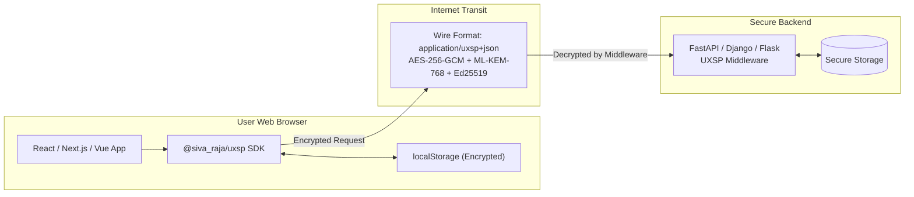

# Web Frontend Integration (JavaScript / TypeScript SDK)

UXSP doesn't just protect backend-to-backend communication. With the official `@siva_raja/uxsp` JavaScript/TypeScript SDK, you can encrypt application-layer data **directly inside the user's web browser** using the native Web Cryptography API (`crypto.subtle`) and Post-Quantum hybrid algorithms before it ever touches the network.

Even if an attacker intercepts TLS traffic, compromises a CDN, or eavesdrops on an unencrypted Wi-Fi hotspot, all payload data remains sealed inside an authenticated Post-Quantum armor.



> 🚀 **Looking for a fullstack combined repository?**  
> Check out the **[End-to-End Fullstack Integration Guide](./fullstack_integration.md)** for a complete, runnable React frontend + FastAPI backend repository.

---

## 1. Installation

Install `@siva_raja/uxsp` into your web project:

```bash
# Using npm
npm install @siva_raja/uxsp

# Using pnpm
pnpm add @siva_raja/uxsp

# Using yarn
yarn add @siva_raja/uxsp
```

The package is **zero-dependency** by default, tree-shakeable, and weighs under **20 kB gzipped**.

---

## 2. Bundler Setup (Vite, Next.js, Webpack)

UXSP works natively in modern browser environments supporting WebCrypto.

### Vite (`vite.config.ts`)
```ts
import { defineConfig } from 'vite';

export default defineConfig({
  optimizeDeps: {
    exclude: ['@siva_raja/uxsp']
  }
});
```

### Next.js (App Router / Pages Router)
In `next.config.js` or `next.config.mjs`:
```js
/** @type {import('next').NextConfig} */
const nextConfig = {
  transpilePackages: ['@siva_raja/uxsp'],
};
export default nextConfig;
```

---

## 3. Pattern 1: Drop-In `uxspFetch` (Autonomous Protocol Switching)

The easiest way to integrate UXSP into any web application is `uxspFetch`. It behaves identically to standard `window.fetch`, but automatically probes whether the destination endpoint supports UXSP.
- If the server supports UXSP: It encapsulates post-quantum keys, signs the request, and encrypts the body.
- If the server is a legacy REST endpoint: It seamlessly falls back to standard HTTP without breaking!

```ts
import { uxspFetch } from "@siva_raja/uxsp";

async function fetchUserProfile() {
  // Uses standard fetch syntax!
  const response = await uxspFetch("/api/user/profile", {
    method: "POST",
    headers: { "Content-Type": "application/json" },
    body: JSON.stringify({ userId: "user_12345" })
  });

  const data = await response.json();
  console.log("Decrypted response:", data);
}
```

---

## 4. Pattern 2: Transparent Global Fetch Interceptor

If your frontend codebase already has dozens of existing API calls (or uses Axios / React Query), you can install the global fetch interceptor once at app initialization:

```ts
import { installFetchInterceptor } from "@siva_raja/uxsp";

// Call this once in your main.tsx or index.ts:
installFetchInterceptor();

// Now ALL standard fetch() calls throughout your entire app
// automatically use Post-Quantum UXSP encryption whenever supported!
const res = await fetch("/api/orders", {
  method: "POST",
  body: JSON.stringify({ item: "Widget", qty: 1 })
});
```

---

## 5. Pattern 3: Explicit Polymorphic Encryption (`sendJSON`, `sendFile`)

If you want explicit control over when and how data is sealed, use the high-level dispatchers:

```ts
import { sendJSON, receiveJSON } from "@siva_raja/uxsp";

// 1. Fetch server's public card once during app launch
const serverCard = await fetch("/api/uxsp/card").then(r => r.json());

// 2. Encrypt sensitive payload before network submission
async function submitSensitivePayment(cardNumber: string, cvv: string) {
  const payload = { cardNumber, cvv, timestamp: Date.now() };

  // Encrypts with ML-KEM-768 + X25519 + AES-256-GCM
  const encryptedPackage = await sendJSON(payload, serverCard);

  // 3. Post to backend
  const response = await fetch("/api/checkout", {
    method: "POST",
    headers: { "Content-Type": "application/json" },
    body: JSON.stringify(encryptedPackage)
  });

  // 4. Decrypt response
  const encryptedResponse = await response.json();
  const decryptedResult = await receiveJSON(encryptedResponse);
  console.log("Payment status:", decryptedResult);
}
```

---

## 6. Pattern 4: Browser Identity Management & Persistence

For authenticated Zero-Trust applications, each client browser can generate its own cryptographic identity, save it encrypted in `localStorage`, and sign outgoing requests.

```ts
import { Identity } from "@siva_raja/uxsp";

// Step 1: Generate or load client identity
export async function getOrCreateBrowserIdentity(userPassword: string): Promise<Identity> {
  const stored = localStorage.getItem("uxsp_client_identity");

  if (stored) {
    // Decrypt existing identity from disk/localStorage
    return await Identity.fromEncryptedJson(stored, userPassword);
  }

  // Generate a brand new hybrid identity (X25519, Ed25519, ML-KEM, ML-DSA)
  const clientIdentity = await Identity.generate("BrowserClient", "CLIENT");

  // Encrypt private keys with user password using Argon2id before storing
  const encryptedBlob = await clientIdentity.toEncryptedJson(userPassword);
  localStorage.setItem("uxsp_client_identity", encryptedBlob);

  return clientIdentity;
}
```

---

## 7. Pattern 5: Real-Time Encrypted WebSockets (`UXSPWebSocket`)

For live chat, collaborative editors, or trading terminals, use `UXSPWebSocket`. It establishes a 3-way mutual post-quantum handshake and protects every binary/text message with monotonic sequencing and replay prevention.

```ts
import { UXSPWebSocket, Identity } from "@siva_raja/uxsp";

async function connectSecureChat() {
  const clientIdentity = await Identity.generate("ChatUser", "CLIENT");

  const ws = new UXSPWebSocket("wss://chat.example.com/stream", {
    identity: clientIdentity
  });

  ws.onopen = () => {
    console.log("UXSP Post-Quantum Handshake Established!");
    ws.send(JSON.stringify({ text: "Hello secure room!" }));
  };

  ws.onmessage = (event) => {
    // Already authenticated and decrypted!
    console.log("Received decrypted message:", event.data);
  };

  ws.onclose = (event) => {
    console.log("Secure connection closed:", event.reason);
  };
}
```

---

## 8. Summary of Frontend Capabilities

| Feature | Method | Use Case |
| :--- | :--- | :--- |
| **Drop-In Fetch** | `uxspFetch(url, options)` | Standard REST calls with automatic fallback |
| **Global Interceptor** | `installFetchInterceptor()` | Seamlessly upgrade existing Axios / fetch apps |
| **Direct JSON Seal** | `sendJSON(data, peerCard)` | Manual, targeted field or form encryption |
| **Direct File Seal** | `sendFile(file, peerCard)` | Client-side file and document encryption |
| **Key Persistence** | `Identity.toEncryptedJson()` | Secure client key storage in localStorage |
| **Encrypted WebSockets**| `new UXSPWebSocket(url, opts)`| Real-time messaging, collaboration, financial feeds |
