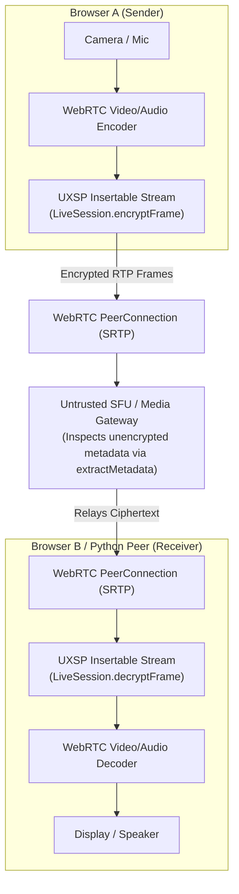

# WebRTC Post-Quantum E2EE Integration Guide

The Universal Exchange Security Protocol (UXSP) provides ultra-low latency, zero-parsing symmetric encryption designed for real-time WebRTC media streams. By leveraging `LiveSession` and `LiveVoiceSession`, you can add end-to-end encryption (E2EE) with post-quantum key exchange to WebRTC **Insertable Streams (Encoded Transforms)** and **RTCDataChannel**.

---

## 🏛️ Architecture: End-to-End Encrypted WebRTC via Untrusted SFUs

Standard WebRTC DTLS-SRTP encrypts data only hop-by-hop between the browser and the Selective Forwarding Unit (SFU / media server). Because the SFU decrypts incoming media packets, any breach on the SFU exposes all participants' video and voice.

UXSP solves this by encrypting encoded media frames **inside the browser before WebRTC packetization**:



---

## 1. Out-of-Band Post-Quantum Signaling Handshake

Before streaming audio or video, peers exchange an initial signaling envelope over your WebSocket or REST signaling server to establish the shared `LiveSession` key.

### Alice (Sender) Creates the LiveSession Envelope
```typescript
import { Identity, LiveSession, PublicCard } from "@siva_raja/uxsp";

// 1. Generate or load Alice's Identity
const alice = await Identity.generate("AliceUser", "client");

// 2. Fetch Bob's PublicCard from your directory / signaling server
const bobCard: PublicCard = await fetchBobPublicCard();

// 3. Create LiveSession: generates a random 256-bit AES key and seals it with ML-KEM-768
const { envelope, session: aliceSession } = await LiveSession.create(alice, bobCard);

// 4. Transmit the sealed envelope to Bob across your signaling channel
signalingSocket.send(JSON.stringify({
    type: "offer-handshake",
    envelope: envelope.toJSON()
}));
```
- **Line-by-Line Explanation:**
  - `await LiveSession.create(alice, bobCard)`: Encapsulates a fresh 256-bit symmetric session key using Bob's Post-Quantum public key and signs the envelope with Alice's ML-DSA-65/Ed25519 dual keys.
  - `signalingSocket.send(...)`: Delivers the handshake envelope out-of-band over standard WebSockets.

---

### Bob (Receiver) Accepts the LiveSession Envelope
```typescript
import { Identity, LiveSession, PublicCard, UXSPEnvelope } from "@siva_raja/uxsp";

// 1. Bob's Identity and Alice's PublicCard
const bob = await Identity.generate("BobUser", "client");
const aliceCard: PublicCard = await fetchAlicePublicCard();

// 2. Listen for incoming signaling offer
signalingSocket.onmessage = async (event) => {
    const data = JSON.parse(event.data);
    if (data.type === "offer-handshake") {
        const receivedEnvelope = UXSPEnvelope.fromJSON(data.envelope);
        
        // 3. Decapsulate envelope and derive matching LiveSession key
        const bobSession = await LiveSession.accept(bob, aliceCard, receivedEnvelope);
        
        console.log("LiveSession established! Ready for E2EE streaming.");
        startMediaPipeline(bobSession);
    }
};
```
- **Line-by-Line Explanation:**
  - `UXSPEnvelope.fromJSON(...)`: Deserializes the wire envelope sent over the signaling server.
  - `await LiveSession.accept(bob, aliceCard, receivedEnvelope)`: Verifies Alice's digital signatures and decapsulates the shared 256-bit AES key.

---

## 2. WebRTC Insertable Streams (Encoded Transform)

WebRTC Insertable Streams allow your web application to intercept raw encoded frames (H.264, VP8, VP9, AV1, Opus) between the encoder and the RTP packetizer.

### 2.1 Video & Audio Frame Encryption (Sender Side)
```javascript
function attachSenderTransform(senderTrack, liveSession) {
    const senderStreams = senderTrack.createEncodedStreams();
    
    const transformStream = new TransformStream({
        async transform(encodedFrame, controller) {
            // 1. Extract raw encoded bytes from WebRTC frame buffer
            const rawFrameBytes = new Uint8Array(encodedFrame.data);
            
            // 2. Encrypt with UXSP LiveSession (sub-millisecond execution)
            // Optional: attach keyframe metadata visible to the SFU
            const isKeyFrame = encodedFrame.type === "key";
            const metadata = new TextEncoder().encode(JSON.stringify({ keyframe: isKeyFrame }));
            
            const encryptedBytes = await liveSession.encryptFrame(rawFrameBytes, metadata);
            
            // 3. Replace frame payload with ciphertext and pass to RTP packetizer
            encodedFrame.data = encryptedBytes.buffer;
            controller.enqueue(encodedFrame);
        }
    });
    
    senderStreams.readable
        .pipeThrough(transformStream)
        .pipeTo(senderStreams.writable);
}
```
- **Line-by-Line Explanation:**
  - `senderTrack.createEncodedStreams()`: Obtains the WebRTC encoded transform streams from `RTCRtpSender`.
  - `await liveSession.encryptFrame(rawFrameBytes, metadata)`: Seals the video/audio payload into a binary envelope `[2-byte Meta Len] [Meta] [2-byte Epoch] [12-byte Nonce] [Ciphertext]` in microseconds.
  - `controller.enqueue(encodedFrame)`: Pushes the encrypted frame back into WebRTC's RTP packetization queue.

---

### 2.2 Video & Audio Frame Decryption (Receiver Side)
```javascript
function attachReceiverTransform(receiverTrack, liveSession) {
    const receiverStreams = receiverTrack.createEncodedStreams();
    
    const transformStream = new TransformStream({
        async transform(encodedFrame, controller) {
            const encryptedBytes = new Uint8Array(encodedFrame.data);
            
            try {
                // 1. Decrypt frame and verify integrity
                const { frame: decryptedBytes, metadata } = await liveSession.decryptFrame(encryptedBytes);
                
                // 2. Replace ciphertext with plaintext for hardware decoder
                encodedFrame.data = decryptedBytes.buffer;
                controller.enqueue(encodedFrame);
            } catch (err) {
                console.warn("Dropped corrupted or replayed frame:", err);
            }
        }
    });
    
    receiverStreams.readable
        .pipeThrough(transformStream)
        .pipeTo(receiverStreams.writable);
}
```
- **Line-by-Line Explanation:**
  - `await liveSession.decryptFrame(encryptedBytes)`: Validates AES-GCM authentication tags, enforces replay protection, and unpacks the raw codec bitstream.
  - `encodedFrame.data = decryptedBytes.buffer`: Passes the decrypted bitstream directly to WebRTC's video/audio hardware decoder.

---

## 3. WebRTC DataChannel Integration (`RTCDataChannel`)

For encrypted chat, game state synchronization, or peer-to-peer file transfers, `LiveSession` encrypts messages sent over `RTCDataChannel`:

```typescript
// Alice (Sender)
const dataChannel = peerConnection.createDataChannel("uxsp-datachannel");

async function sendSecureMessage(messageText: string) {
    const plaintextBytes = new TextEncoder().encode(messageText);
    const ciphertextBytes = await aliceSession.encryptFrame(plaintextBytes);
    dataChannel.send(ciphertextBytes);
}

// Bob (Receiver)
dataChannel.onmessage = async (event: MessageEvent) => {
    const ciphertextBytes = new Uint8Array(event.data);
    try {
        const { frame: plaintextBytes } = await bobSession.decryptFrame(ciphertextBytes);
        const text = new TextDecoder().decode(plaintextBytes);
        console.log("Decrypted DataChannel Message:", text);
    } catch (err) {
        console.error("Authentication or replay error:", err);
    }
};
```
- **Line-by-Line Explanation:**
  - `aliceSession.encryptFrame(...)`: Packages arbitrary binary or text buffers into encrypted frames.
  - `bobSession.decryptFrame(...)`: Authenticates the frame and prevents within-session packet replay.

---

## 4. Python Backend WebRTC Peer (`aiortc` Integration)

If your architecture uses a Python media backend (e.g. for AI transcription, computer vision, or automated recording), you can connect to browser WebRTC streams using `aiortc` and `uxsp.aio`:

```python
import asyncio
from aiortc import MediaStreamTrack, RTCPeerConnection
import uxsp.aio as aio
from uxsp.core.live import LiveSession

class EncryptedVideoTransformTrack(MediaStreamTrack):
    """Intercepts video frames from aiortc and decrypts them with UXSP."""
    kind = "video"

    def __init__(self, track: MediaStreamTrack, session: LiveSession):
        super().__init__()
        self.track = track
        self.session = session

    async def recv(self):
        # 1. Receive raw WebRTC frame from network
        frame = await self.track.recv()
        
        # 2. Extract encrypted bytes from frame planes
        encrypted_bytes = bytes(frame.planes[0])
        
        # 3. Decrypt using UXSP LiveSession
        decrypted_bytes, metadata = self.session.decrypt_frame(encrypted_bytes)
        
        # Process decrypted frame (e.g. computer vision inference)
        print("Processed frame with metadata:", metadata.decode("utf-8"))
        return frame
```
- **Line-by-Line Explanation:**
  - `MediaStreamTrack`: Subclasses `aiortc`'s media track to create an asynchronous frame processing pipeline.
  - `self.session.decrypt_frame(...)`: Decrypts incoming frames on the Python server with Post-Quantum security guarantees.

---

## 5. Zero-Knowledge SFU Packet Routing (`extractMetadata`)

Selective Forwarding Units (like mediasoup, LiveKit, or Janus) need to know which packets contain video keyframes or specific layer IDs to manage bandwidth. With UXSP, the SFU can inspect frame metadata **without possessing the decryption keys**:

```typescript
import { LiveSession } from "@siva_raja/uxsp";

function handleSfuRelay(rawRtpPacketPayload: Uint8Array): boolean {
    // The SFU does not have the LiveSession key!
    // Extract authenticated unencrypted metadata:
    const metadataBytes = LiveSession.extractMetadata(rawRtpPacketPayload);
    const meta = JSON.parse(new TextDecoder().decode(metadataBytes));
    
    if (meta.keyframe) {
        console.log("SFU detected keyframe. Forwarding to all new subscribers!");
        return true;
    }
    
    return true; // Forward standard frame
}
```
- **Line-by-Line Explanation:**
  - `LiveSession.extractMetadata(...)`: Safely extracts the unencrypted metadata slice from the binary frame header in constant time.
  - Guarantees that the SFU never gains access to plaintext video or voice content.

---

## 6. Cryptographic Guarantees & Operational Checklist

1. **Replay Rejection**: Each frame contains a unique 12-byte nonce and sequence counter. Replayed or duplicated frames are dropped immediately before decryption.
2. **HKDF Key Ratcheting**: `LiveSession` automatically derives a fresh 256-bit symmetric key every 65,536 frames, preventing AES-GCM nonce wear-out during multi-hour video calls.
3. **NIST PQC Authentication**: The signaling handshake uses ML-KEM-768 for quantum-safe key exchange and ML-DSA-65/Ed25519 for dual digital signatures, guaranteeing that man-in-the-middle attackers cannot inject fake signaling offers.

